# 矩阵键盘
矩阵键盘是一种按键扫描方式，它允许我们使用 $\sqrt{n}$ 个引脚来扫描 $n$ 个按键，以节省 I/O 引脚。

## 原理
### 逐行（或逐列）扫描
矩阵键盘的原理是将按键排列成一个矩阵，然后使用逐行（或逐列）扫描的方式来检测按键是否被按下。

以 16 按键的矩阵键盘为例，我们将按键排列成一个 4x4 的矩阵（注：即使外观不是矩形，其电路逻辑也可以是矩形），将同一行的按键的一端连接到一起形成 4 个“行引脚”，将同一列的按键的另一端连接到一起形成 4 个“列引脚”。这样，我们就可以使用 8 个引脚来扫描 16 个按键。



我们将行引脚设置为输出，将列引脚设置为输入并配置下拉电阻。每次扫描时，将行引脚依次输出高电平，然后检测所有列引脚的电平，如果有列引脚为高电平，则表示（对应行）该列的按键被按下。

当然，也可以将行引脚设置为输入，将列引脚设置为输出。我们也可以输出低电平，并在输入端配置上拉电阻。原理类似，不再赘述。

我们以非常高的频率来扫描矩阵键盘，以保证用户按下按键时，我们总是能够及时地检测到。由于现代 MCU 的运算速度非常快，因此可以轻易地让人认为是“实时”的。

???+ "扫描实例"
    假设 4x4 矩阵键盘的第 3 行第 2 列的按键被按下：  
    

    - 行引脚 1 输出高电平，其它行引脚输出低电平。此时，列引脚（输入下拉）1、2、3、4 的电平分别为：低、低、低、低。
    - 行引脚 2 输出高电平，其它行引脚输出低电平。此时，列引脚（输入下拉）1、2、3、4 的电平分别为：低、低、低、低。
    - 行引脚 3 输出高电平，其它行引脚输出低电平。此时，列引脚（输入下拉）1、2、3、4 的电平分别为：低、***高***、低、低。
    - 行引脚 4 输出高电平，其它行引脚输出低电平。此时，列引脚（输入下拉）1、2、3、4 的电平分别为：低、低、低、低。

    在行引脚 3 输出高电平时，在列引脚 2 读取到高电平，因此我们可以判断第 3 行第 2 列的按键被按下。

### “鬼键” 问题
在上述的矩阵键盘设计中，如果有多个按键同时被按下，我们有时可以正确检测，有时却会发生错误，将未按下的按键误判为按下。这种现象被称为“鬼键”（Ghost Key）问题。



以上图为例，假设 R2C2、R2C3、R3C2 三个键同时被按下。当行引脚 3 输出高电平时，列引脚 2 和 3 都会读取到高电平，故而我们会误判 R3C3 也被按下。造成这种现象的原因是，R3 上的高电平会通过 C2 传递到 R2 上。

这一现象可以通过在行引脚和列引脚之间加入二极管来解决。在上述方案中，我们通过行引脚输出、列引脚输入的方式来检测按键，因此我们需要加入从行引脚指向列引脚的二极管，以防止高电平从行引脚传递到列引脚后又通过列引脚传递到另一行的行引脚上，导致“鬼键”问题。



???+ "二极管的最高工作频率"
    需要注意的是，二极管的导通速度是有限的，因此在选型及使用二极管时，您需要注意二极管的最高工作频率，保证您的扫描频率不会超过二极管的最高工作频率。如果您使用较高的扫描频率，您可能需要肖特基二极管等允许高速切换的二极管。

## 实现
以 STM32 + HAL 库实现 4x4 矩阵键盘的实例代码如下：

```c
#include <stdint.h>
#include <stdbool.h>
#include "main.h"

// 引脚配置说明
// 行引脚：推挽输出模式，分别命名为 KB_R1、KB_R2、KB_R3、KB_R4
// 列引脚：下拉输入模式，分别命名为 KB_C1、KB_C2、KB_C3、KB_C4

void scan_column_in_matrix(GPIO_TypeDef *row_port, uint16_t row_pin, bool *states)
{
    HAL_GPIO_WritePin(row_pin, row_pin, GPIO_PIN_SET);

    // 当执行过快时，可能会导致读取到错误的状态
    // 这里使用 NOP 延时 4 个时钟周期
    __NOP();
    __NOP();
    __NOP();
    __NOP();

    // 读取列引脚的状态
    // p.s. 如果 C1、C2、C3、C4 在同一个 GPIO Port 上，还有其它方法可以一次性读取，提高效率哦
    states[0] = HAL_GPIO_ReadPin(KB_C1_GPIO_Port, KB_C1_Pin) == GPIO_PIN_SET;
    states[1] = HAL_GPIO_ReadPin(KB_C2_GPIO_Port, KB_C2_Pin) == GPIO_PIN_SET;
    states[2] = HAL_GPIO_ReadPin(KB_C3_GPIO_Port, KB_C3_Pin) == GPIO_PIN_SET;
    states[3] = HAL_GPIO_ReadPin(KB_C4_GPIO_Port, KB_C4_Pin) == GPIO_PIN_SET;

    HAL_GPIO_WritePin(row_pin, row_pin, GPIO_PIN_RESET);
}

void scan_matrix(bool *states)
{
    scan_column_in_matrix(KB_R1_GPIO_Port, KB_R1_Pin, &states[0]);
    scan_column_in_matrix(KB_R2_GPIO_Port, KB_R2_Pin, &states[4]);
    scan_column_in_matrix(KB_R3_GPIO_Port, KB_R3_Pin, &states[8]);
    scan_column_in_matrix(KB_R4_GPIO_Port, KB_R4_Pin, &states[12]);
}
```

使用方法如下：

```c
while(1) {
    bool states[16];
    scan_matrix(states);

    if (states[0]) {
        // R1C1 被按下
    }
    if (states[1]) {
        // R1C2 被按下
    }
    if (states[4]) {
        // R2C1 被按下
    }
    // ...
}
```