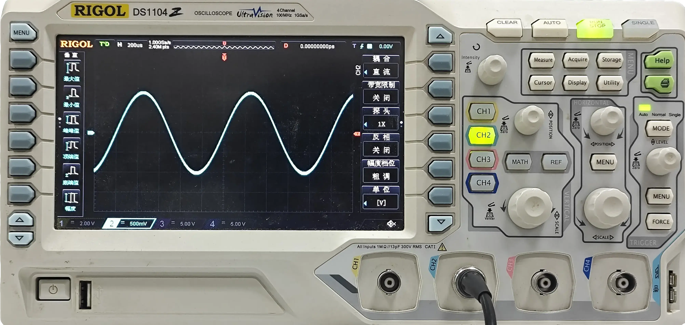
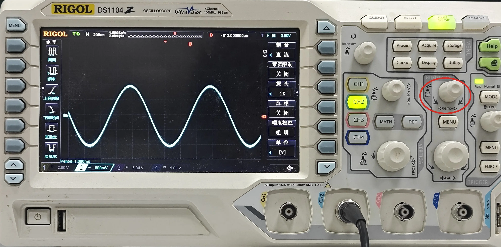
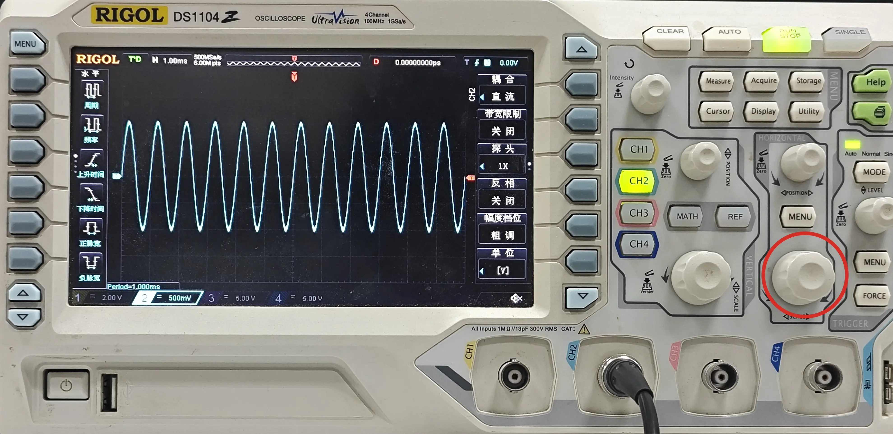
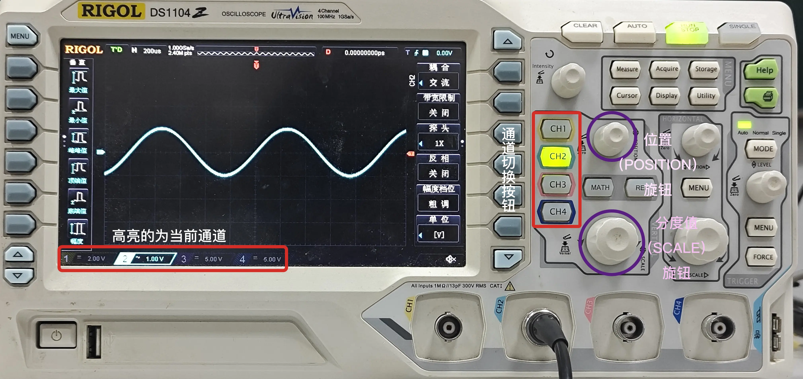

# 基本使用方法
## 自动调整
  

1. 安装探头，将示波器的探头插入示波器的插孔中。  
   示波器的插孔一般为 BNC 接口，插入时要注意插头的方向，插头的两个凸起应与插孔的两个凹槽对应，插入时要用力插入，插入后要用力**向里转动一下**，使插头与插孔之间的接触更加牢固。
2. 打开示波器，将示波器的探头接地端接地，将示波器的探头信号端接入待测电路。
   注意：对于普通的无源探头，接地端应接地（示波器多个通道的地是连接在一起的）；对于差分探头，正极、负极可以接入待测电路的任意两个不同的点。
3. 调整示波器的探头倍率设置，如探头有 10:1 衰减比（常标注为 10x 探头），则示波器上要设置为 10x。
   通常而言，需要先按下对应的通道键（如 CH2 键），然后在菜单中找到相关设置并调整。
4. 使用 AUTO 键自动调整示波器的各项参数，使得波形在屏幕上显示得最佳。  
   注意：自动调整时，示波器会自动调整水平、垂直、触发等参数，但是不会自动调整探头的倍率设置，需要手动调整。

## 基本操作
### 水平调整
以 RIGOL DS1104 示波器为例，使用 HORIZONTAL 区域的 SCALE 旋钮可以调整水平方向的时间分度值，使得波形在屏幕上显示得最佳。  

使用 HORIZONTAL 区域的 POSITION 旋钮可以调整水平方向的位置，使得波形在屏幕上显示得最佳。该旋钮也可按下，快速调整水平方向的位置到屏幕中央。  

使用 HORIZONTAL 区域的 SCALE 旋钮可以调整水平方向的分度值，选择查看较小时间段内的波形细节，或者较大时间段内的波形总体形状。

水平调整同时作用于示波器的所有通道，即所有通道的水平方向的时间分度值和位置都会同时调整。这保证了在同一竖线上，不同通道显示的波形是同一时刻的波形。  

### 垂直调整
通常而言，数字示波器具有多个通道，每个通道都有其垂直方向的属性，可以分别设置。

在部分型号的示波器上，每个通道都有独立的旋钮，可以直接调整对应通道的垂直方向的状态。在其它型号的示波器，只存在几个旋钮，需要通过通道按键来选择当前要调整的通道，然后通过旋钮来调整当前通道的垂直方向的状态。

以 RIGOL DS1104 示波器为例：

- 屏幕右下角显示了 4 个通道，高亮的通道则为当前要调整的通道。如果需要调整其它通道，则需要先按下对应的通道按键，使其高亮。
- 然后，可以使用 VERTICAL 区域的 SCALE 旋钮调整垂直方向的电压分度值，使用 VERTICAL 区域的 POSITION 旋钮调整垂直方向的位置，使得波形在屏幕上显示得最佳。
- POSITION 旋钮也可按下，快速调整垂直方向的位置到屏幕中央。

### RUN/STOP 按钮
RUN/STOP 按钮用于控制示波器的运行状态。以 RIGOL DS1104 示波器为例，按下 RUN/STOP 按钮后，示波器将开始捕获并显示波形，RUN/STOP 按钮变为绿色；再次按下 RUN/STOP 按钮后，示波器将停止捕获并显示波形，RUN/STOP 按钮变为红色。

您可以通过 RUN/STOP 按钮来停止波形捕获，此时示波器将显示最后一次捕获到的波形，可以用来慢慢分析。