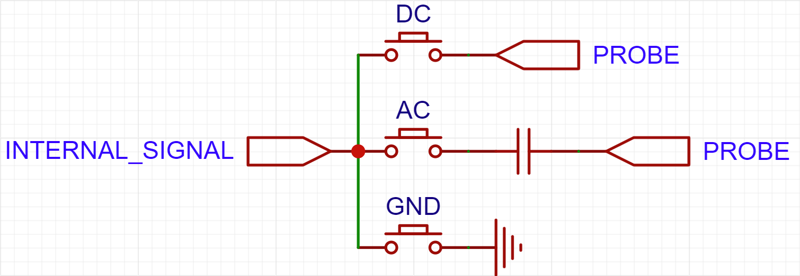
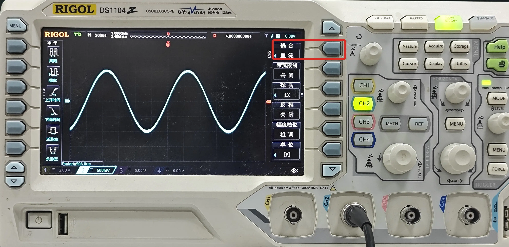

# 耦合方式
示波器的耦合方式有 DC（直流）、AC（交流）、GND（接地） 三种。  

以 RIGOL DS1104 示波器为例，调整耦合方式应该按照以下步骤进行：

- 按下对应通道的按钮，使得该通道高亮，并在屏幕右侧显示该通道的相关设置。
- 在屏幕右侧的『耦合』选项中，选择对应的耦合方式。

## DC 耦合
DC 耦合方式下，相当于待测信号直接进入示波器，示波器会显示待测信号中直流分量和交流分量。

## AC 耦合
AC 耦合方式下，相当于待测信号串联一个电容后进入示波器，示波器会显示待测信号的交流分量，直流分量被屏蔽。

## GND 耦合
GND 耦合方式下，示波器会将待测信号接地，在屏幕上显示一条 0V 的水平基线。