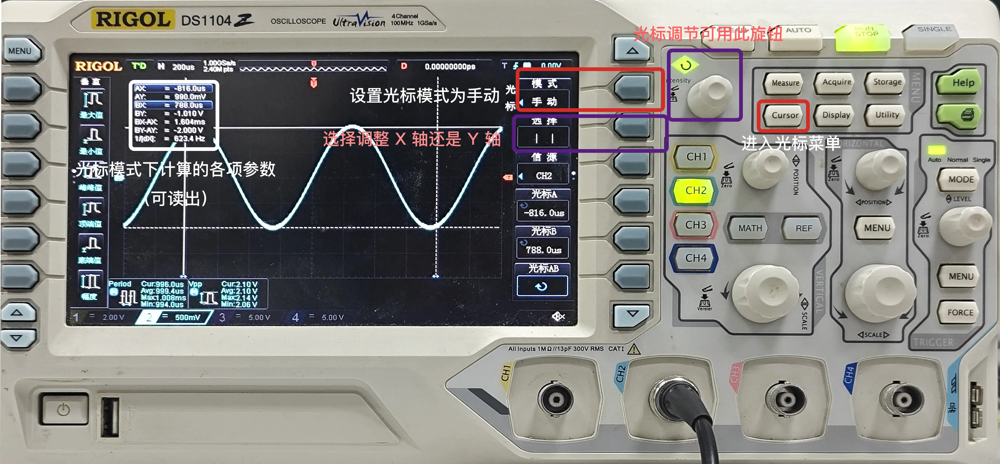
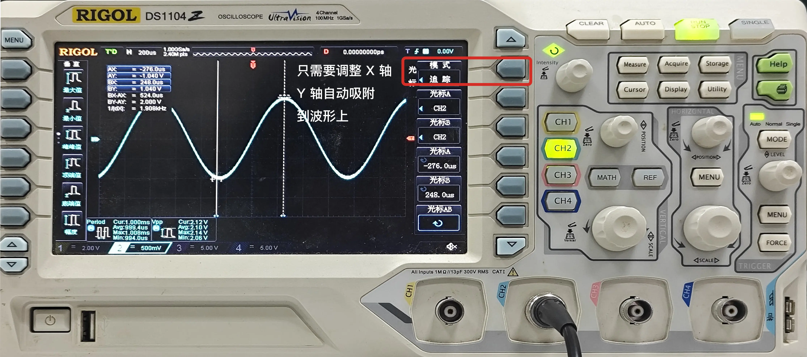
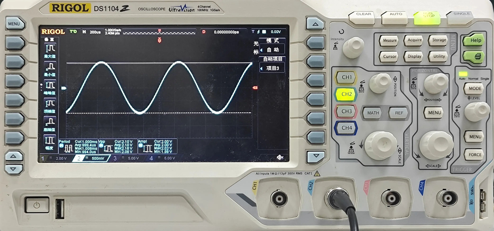

# 光标
示波器具有光标模式，可自动计算两个光标之间的时间和电压差。光标模式可以用于手动测量信号的频率、周期、电压、时间等。

在使用光标模式时，为方便起见，常常先按下 RUN/STOP 停止示波器的运行，然后再慢慢调整光标测量数据。

## 手动模式

要进入手动模式，首先按下 CURSOR 按键，然后在『模式』选项中，选择『手动』模式。

手动模式下，示波器会显示两个光标 `A` 和 `B` 。可以通过旋转示波器上的旋钮来移动光标，通过单击旋钮来切换移动的光标。

手动模式下，X 轴和 Y 轴的光标可以分别移动，不一定要在波形上。

## 追踪模式

要进入追踪模式，首先按下 CURSOR 按键，然后在『光标模式』菜单中，选择『追踪』模式。

追踪模式下，两个光标 `A` 和 `B` 会自动跟随波形，可以通过旋转示波器上的旋钮来调整 X 轴位置，Y 轴位置自动吸附在波形图上。

## 自动模式

要进入追踪模式，首先按下 CURSOR 按键，然后在『光标模式』菜单中，选择『自动』模式。部分示波器可能没有该模式。

自动模式可以可视化出[测量](../measure/index.md)模式中测量项的光标位置，不可手动改变光标位置。