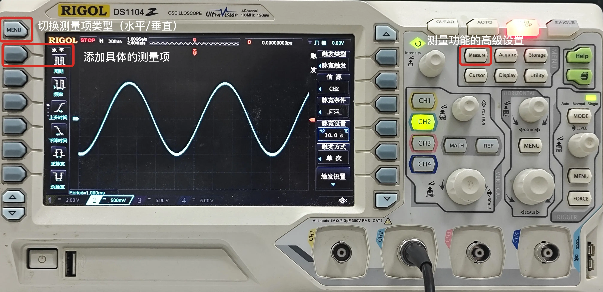
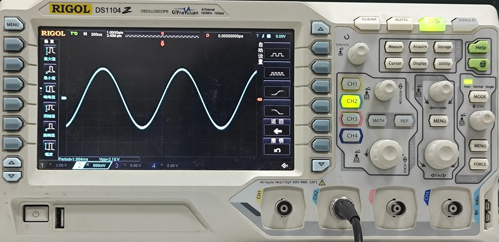
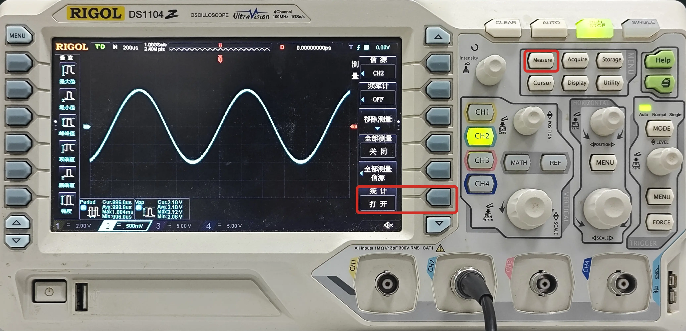

# 测量
## 添加测量项
数字示波器往往具有测量功能，可以测量信号的各种参数，如峰峰值、平均值、最大值、最小值、频率、周期、占空比等。  
  

先选择要测量的通道，然后在测量区域选择要测量的测量项，示波器将自动测量并显示结果（屏幕右下角）。

## 统计功能
以 RIGOL DS1104 示波器为例，使用 MEASURE 按钮进入测量设置界面，可以打开测量的统计功能，看到测量数据的最大值、最小值、平均值等信息。

