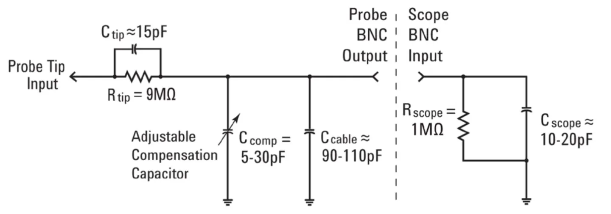
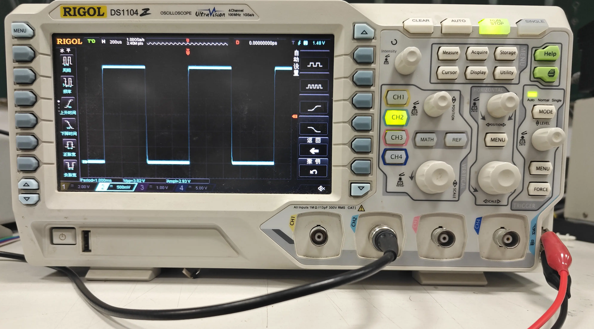
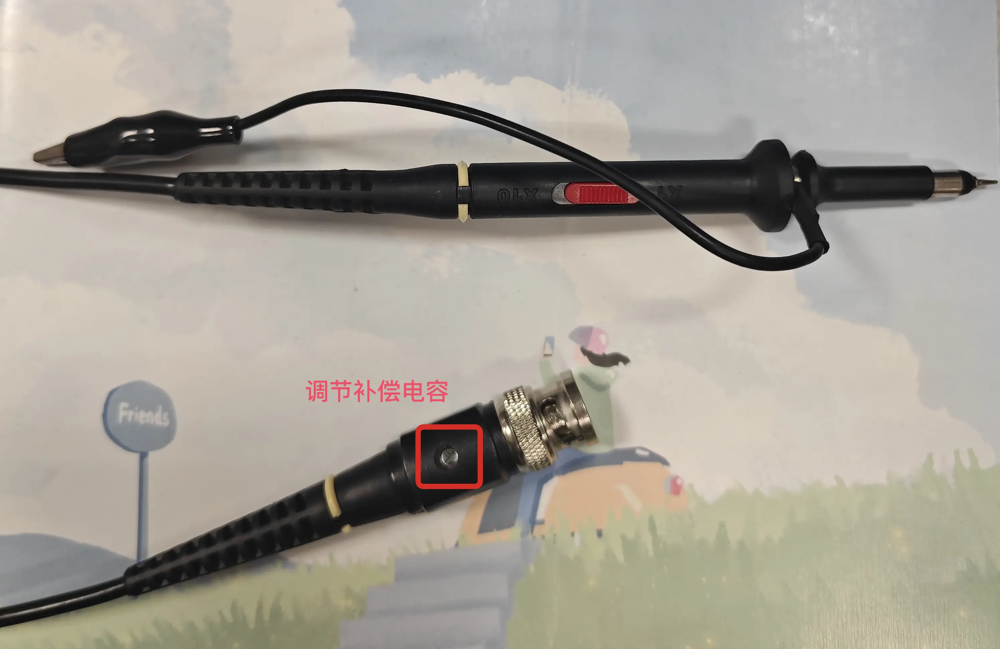
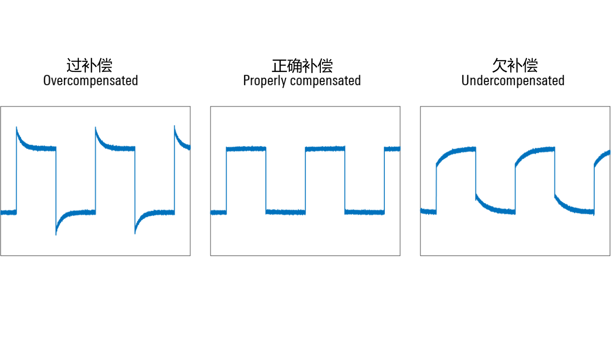

# 探头补偿
## 理论知识

示波器和 10:1 探头的简化模型如上图所示，其中示波器的输入阻抗为 $R_{scope}$，探头的补偿电容为 $C_{comp}$。

所有示波器都具有特定的固有电容（这是真实世界必然存在的）。此电容一般较低，对于低频信号而言没有太大效果，但对于高频信号而言，它会产生一个低通滤波器，从而导致信号失真。

示波器专用探头往往并联了一个补偿电容 $C_{comp}$，可以通过螺丝刀进行调节，以保证 10:1 的分压比。理想情况下，可以通过以下公式导出补偿电容：

$$
\displaylines{C_{\text{parallel}}=C_{\text{scope}}+C_{\text{cable}}+C_{\text{comp}} \\
\frac{1}{R_{\text{tip}} \cdot C_{\text{tip}}}=\frac{1}{R_{\text{scope}} \cdot C_{\text{parallel}}}}
$$

## 调节补偿电容
  
示波器右侧有两个金属接头，输出一组测试用的方波信号，我们首先将探头连接到测试信号上，然后使用 AUTO 显示出方波。

  
在探头上找到调节补偿电容的螺丝，使用无感螺丝刀（绝缘、非金属）进行调节，直到方波的上升沿和下降沿都变得尖锐。

