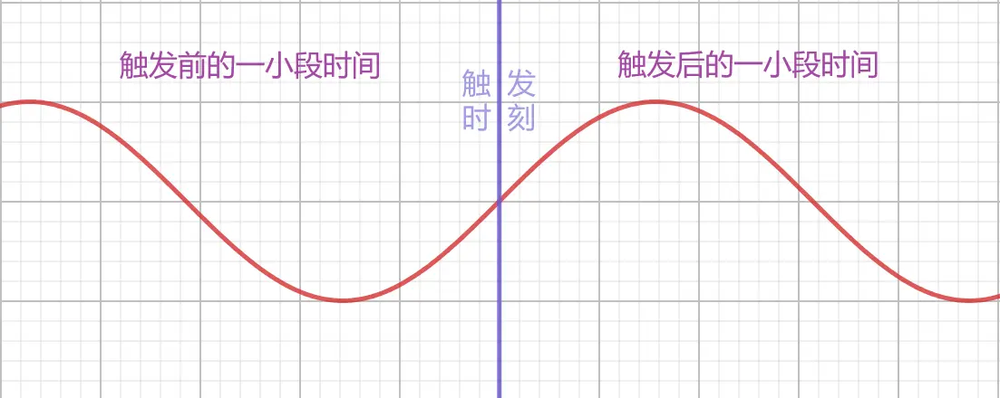
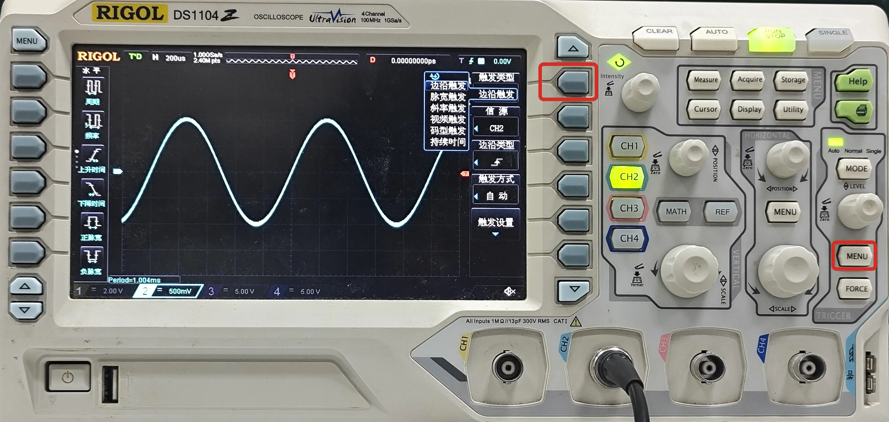
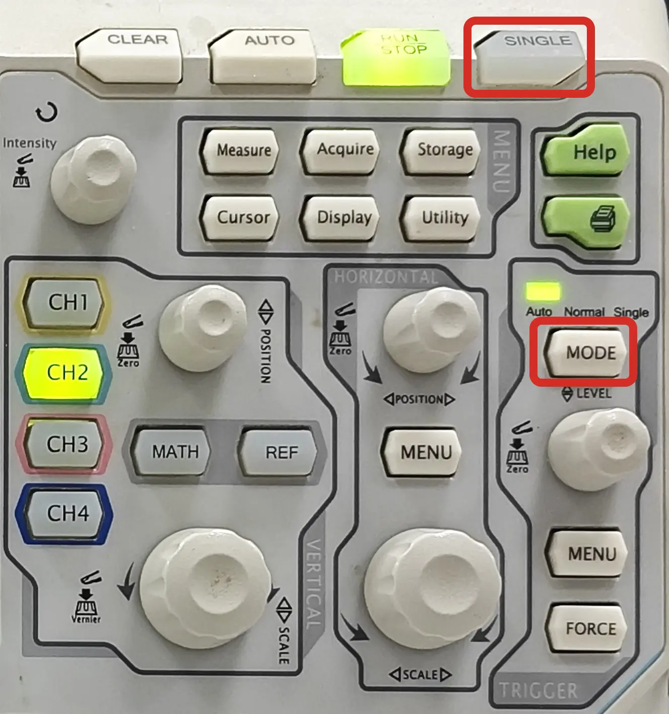

# 触发
## 触发原理
当示波器捕捉到的波形流中的某一个波形满足这一条件时，示波器即实时捕获该波形和其相邻部分（触发），并显示在屏幕上。

触发时刻将显示在屏幕的水平位置设置处（顶部标注 T 的位置），通常将显示在屏幕中央（如果水平位置设置为 0）。  
对于周期信号，由于触发条件在同一周期内往往只出现一次，触发时刻在周期内的相对位置是固定的，故而信号可以稳定显示在屏幕上。

## 触发源
触发源通常可以通过菜单调整，需要注意的是，示波器只能有一个触发源，即使你同时连接了多个信号源，也只能选择其中一个作为触发源。（因为示波器需要保证各通道之间的时序关系是一致的）

以 RIGOL DS1104 示波器为例，通过 TRIGGER 区域的 MENU 按钮可以打开触发菜单，调整触发源。

???+ note "提示"
    当连接多个信号时，如果其中一个信号的频率是其他信号的整数倍，那么我们通常设置频率较低的那个信道为触发源，以得到稳定的信号。

## 触发类型
触发类型通常可以通过菜单调整。

以 RIGOL DS1104 示波器为例，通过 TRIGGER 区域的 MENU 按钮可以打开触发菜单，调整触发类型。常见的触发类型有：边沿触发、脉宽触发等。  

### 边沿触发
边沿触发是最常用的触发类型，通常可以设置为上升沿触发、下降沿触发、上升沿或下降沿触发、窗口触发等。示波器将在『指定的边沿』到达『触发电平』时触发。

### 脉宽触发
脉宽触发通常可以设置为大于、小于、等于、不等于等。示波器将在『指定的脉宽』（正脉宽或负脉宽）达成一定长度后触发。正脉宽、负脉宽的电平要求依据触发电平的设置。

## 触发电平
触发电平通常可以通过菜单调整，大部分示波器也留有单独的旋钮用来快速调整触发电平。

以 RIGOL DS1104 示波器为例，通过 TRIGGER 区域的 LEVEL 按钮即可调整触发电平。大部分触发类型均需要设置触发电平，如设置为 上边沿触发 时，若触发电平为 2V，示波器将在信号上升沿到达 2V 时触发。

???+ note "提示"
    通常情况下，我们将触发电平设置为信号的中间值。如对于 0~5V 的信号，我们将触发电平设置为 2.5V。

## 触发模式
触发模式通常可以通过菜单调整，大部分示波器也留有单独的按钮用来快速切换触发模式。

以 RIGOL DS1104 示波器为例，TRIGGER 区域的 MODE 按钮用于切换触发模式，分别为 AUTO、NORMAL 和 SINGLE。此外，顶部还有一个 SINGLE 按钮，用于快速切换到 SINGLE 模式。  

### 自动触发模式（AUTO）
在这种模式下，如果较长时间内没有触发事件发生，示波器将根据内部时钟信号自动捕获并显示波形（此时显示出的信号通常是不稳定的、不断变化的）。

### 普通触发模式（NORMAL）
在这种模式下，示波器将等待触发事件的发生，如果较长时间内没有触发事件发生，示波器将不会捕获并显示波形。

### 单次触发模式（SINGLE）
在这种模式下，示波器将等待触发事件的发生，发送第一次触发后自动停止捕获并显示波形。