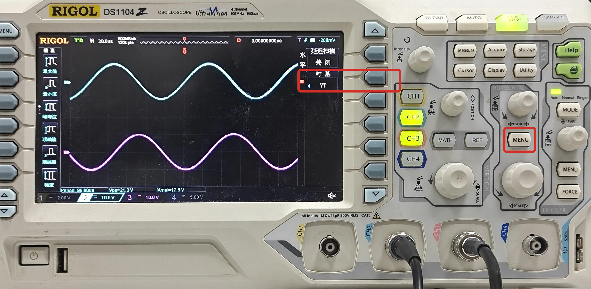

# X-Y 模式
现代多通道示波器通常具有 X-Y 模式，可以将两个信号分别作为 X 轴和 Y 轴的输入，绘制出 Lissajous 图形。

以 RIGOL DS1104 示波器为例，按下 HORIZONTAL 区域的 MENU 按键，进入水平菜单，可选择『X-Y』模式。

如以下 Y-T 图所示，两个信号为同频同幅的正弦波，但相位差为 90°，因此在 X-Y 模式下绘制出的 Lissajous 图形为一个圆。

??? note "理论分析：为什么是圆？"
    波形：

    $$
    \begin{aligned}
    x &= A \sin(\omega t) \\
    y &= A \sin(\omega t + \frac{\phi}{2})
    \end{aligned}
    $$

    易得：

    $$
    \begin{aligned}
        x^2 + y^2 &= A^2 \sin^2(\omega t) + A^2 \sin^2(\omega t + \frac{\phi}{2}) \\
            &= A^2 \sin^2(\omega t) + A^2 \cos^2(\omega t) \\ 
            &= A^2
    \end{aligned}
    $$

