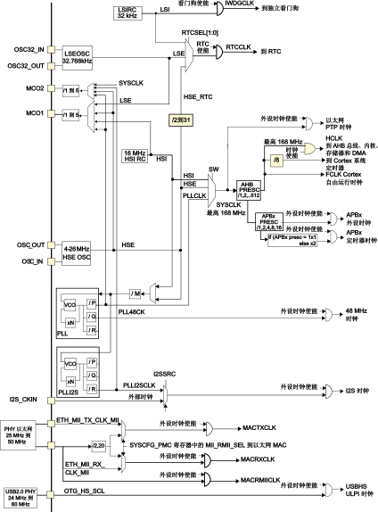

# 时钟树
## 为什么要有时钟信号
  
如上图为一个简单的门电路，其逻辑为：`O = (A & B) ^ B`

现在，我们把 $B$ 的输入信号从 0 改为 1，让我们看一下时序图：

可以看到，当 $B$ 信号发生变化时，输出信号 $O$ 先变为 1，然后才变为 0（即所谓 空翻 现象）。这是因为门电路的延迟导致的。

???+ note "为什么？"
    当 $B$ 信号发生变化时，AND 门的输出信号并不会立即变化，XOR 门的输出信号在经过延迟后变为 1，然后 AND 门的输出信号终于变为 1，从而 XOR 门的输出信号在经过延迟后再变为 0。

一个简单的解决方法是在输出端加入边沿 D 触发器：  
  
边沿 D 触发器的特点是：在 $R$ 为低电平时，输出 $Q$ 维持为上一次的值，直到 $R$ 从低电平转变为高电平时，输出 $Q$ 才会变为 $D$ 的新值。

当将 $R$ 接到时钟信号时，我们可以控制输出信号的变化时机（即时钟上升沿），只要我们避免使用过高频率的时钟，空翻现象造成的错误逻辑就不会被传递到后续的逻辑中，从而屏蔽空翻现象对逻辑的影响。

现代处理器通常都是由大量的门电路组成的，而这些门电路由时钟信号控制的，可以保证处理器的逻辑运算是按照时钟信号的节奏进行的，从而避免空翻现象对逻辑的影响。

## 时钟信号的来源
STM32 单片机共有两种时钟信号，用于不同用途：

- HSx（High Speed）：高速时钟信号
- LSx（Low Speed）：低速时钟信号

单片机内部自带了 RC 振荡器，可以产生两个时钟信号，分别称为 HSI（高速内部时钟信号） 和 LSI（低速内部时钟信号），但内部时钟信号的精度通常不高。

为了提高时钟信号的精度，通常会在单片机外部接入晶振提供时钟信号，有两个信号可以提供，分别称为 HSE（高速外部时钟信号） 和 LSE（低速外部时钟信号）。

???+ 提示
    对于 WeAct Studio 设计的 MiniF4 系列开发板，开发板已自带相关晶振，HSE 为 25MHz（连接在 PH0 和 PH1 引脚），LSE 为 32.768kHz（连接在 C14 和 C15 引脚）。

## 时钟树
STM32 单片机内部的时钟信号由一个复杂的时钟树提供，但总体而言，时钟信号都来自于 HSx 和 LSx 两个信号源，然后经过一系列的分频、倍频、分频后再倍频等操作，最终为各个模块提供不同频率的时钟信号。由于这种时钟结构通常是树状的，所以称为时钟树。

=== "STM32F4xx 时钟树"
    

=== "STM32F103 时钟树"
    

时钟树的结构在不同型号的单片机中可能会有所不同。通常而言，时钟树主要包含以下几个部分：

### 高速部分
- 通过 HSI / HSE 或经过 PLL 倍频后的 PLLCLK 信号，为系统提供系统时钟（SYSCLK）
- 通过 SYSCLK 信号，经过一次分频，为总线提供 AHB 时钟（HCLK）
- 通过 AHB 时钟为处理器内核、内存、DMA 等重要单元提供时钟信号
- 通过 AHB 时钟，经过分频、倍频，为 APBx 总线提供 APBx 时钟（PCLKx），其中 APB 是 Advanced Peripheral Bus 的缩写，意思是高级外设总线，APBx 指 APB1 或 APB2
- 通过 APBx 时钟为各个外设（定时器、USART、SPI、I2C、ADC 等）提供时钟信号

### 低速部分
- 主要为 RTC 和 IWDG（独立看门狗）提供时钟信号

## 如何配置时钟树
在现代 STM32 单片机开发中，我们通常使用 CubeMX 来配置时钟树：

1.   
   在 Pinout & Configuration 标签页中，选择 RCC（Reset and Clock Control）模块，根据需要开启或关闭 HSE、LSE 时钟源。
2.   
   在 Clock Configuration 标签页中，可视化地配置时钟树，CubeMX 会自动计算分频、倍频等参数，并对时钟树配置进行正确性检查。

???+ "实例：对于 MiniF401 开发板，拉高到最大频率 84MHz"
    1. 在 RCC 模块中，开启 HSE 时钟源：选择 Crystal/Ceramic Resonator。
    2. 在 Clock Configuration 标签页中，将 Input frequency 设置为 25MHz，将 PLL Source Mux 设置为 HSE，将 System Clock Mux 设置为 PLLCLK，然后在 HCLK 中输入 84MHz，回车让 CubeMX 自动计算分频、倍频等参数。
    
    