# I2C 协议
## 开漏模式和线与（复习）
### GPIO 的开漏输出模式
对于单片机的 IO 引脚，其逻辑状态通常可以分为以下几种：

- LOW（0V）
- HIGH（3V3 或 5V，对于 STM32/ESP32 来说均为 3V3）
- HiZ（高阻抗，不输出电流）

GPIO 输出控制器的简化框图如下：  
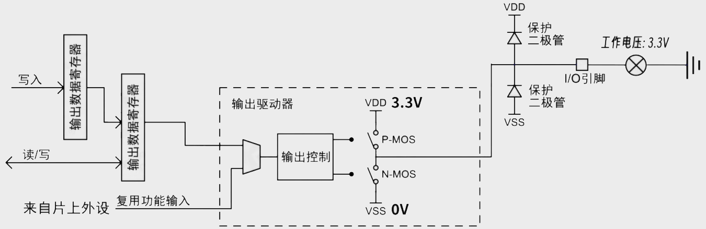

当配置为推挽输出（Push-pull Output）时，单片机可以输出 LOW 或 HIGH。  

当配置为开漏输出（Open-drain Output）时，单片机可以输出 LOW 或 HiZ。（P-MOS 永远处于截止状态，排除输出引脚本身，可以认为 N-MOS 的漏极是开路，故称为开漏）  

### 线与功能
当多个开漏模式引脚相连时，整个线路的电平状态取决于这些引脚的输出状态。只有在所有引脚均输出高阻态时，线路上的高电平才由外部上拉电阻提供，此时的电压等于上拉电阻连接的电源电压。反之，如果任一引脚输出低电平，整条线路就会被拉至接地电位，即 0 伏。

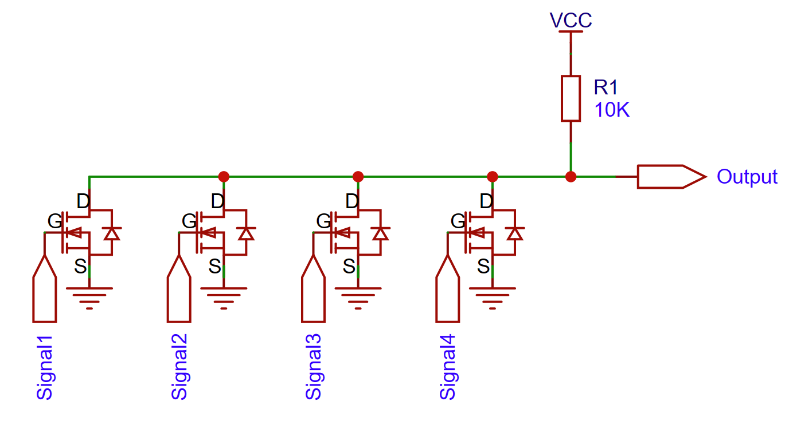

注意：推挽模式不能这么做，否则电源与地会直接短路，造成 GPIO 内部 MOS 管被击穿或电源系统损坏。

## I2C 协议简介
I2C（Inter-Integrated Circuit）是一种同步的串行通信协议，由 Philips 公司在 1980 年代提出，用于芯片间通信。I2C 协议是一种主从式的通信协议，且允许在同一总线上存在多主机、多从机。I2C 协议的主要特点是通信线路少，但通信速度慢。

I2C 通信必须由主机发起通信（无论是发送还是接收），从机被动接受。从机不能主动发送数据。

## I2C 接口形式
I2C 接口有如下几个引脚：

- SCL：时钟信号
- SDA：数据信号

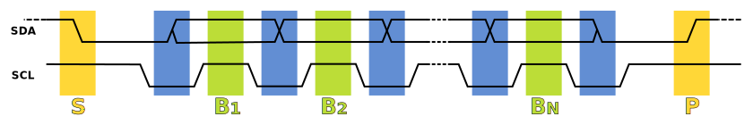

SCL 和 SDA 均应使用开漏输出的 GPIO 引脚，并通过上拉电阻连接到 3V3 电压。

### 上拉电阻阻值的确定
**常取经验值 4.7 kΩ，一般不宜使用内置上拉电阻（40+ kΩ）**  
**如果您看不懂这一部分，请先忽略**  

??? "STM32F401 内置上下拉电阻阻值参数"
    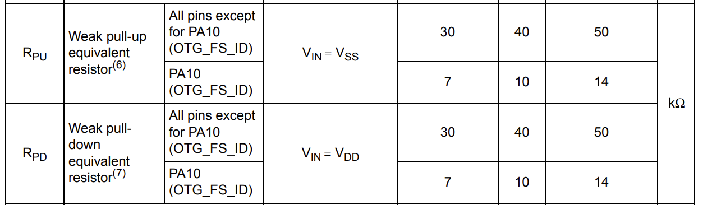

    图中 PU 为上拉，PD 为下拉，右侧三个数值分别为『最小值』、『典型值』、『最大值』。

#### 定性分析

- 上拉电阻的阻值不易过小，否则会导致电流过大，低电平值增大（输出低电平时，上拉电阻与内部 MOS 构成串联分压结构）等问题，影响通信质量并可能造成器件损坏。
- 上拉电阻的阻值不易过大，否则与导线的寄生电容构成 RC 电路后，易因电容充放电时间过长，影响通信质量。

#### 定量分析

$$
\min \{R\}＝\frac{\min \{ V_{dd} \} - 0.4 \text{V}}{3\text{mA}}
$$

其中，$V_{dd}$ 为电源电压，$0.4\text{V}$ 为 I2C 标准规定的低电平的最大电压，$3\text{mA}$ 为 I2C 标准规定的最大电流。

$$
\max \{R\}＝\frac{t_\text{r}}{0.8473 \cdot C_\text{bus}}
$$

其中，$t_\text{r}$ 为上升沿时间，$C_\text{bus}$ 为总线上的总电容。


### 从机地址
I2C 总线上的消息可被每个设备接收，我们会为每个设备分配一个地址，以便主机能够区分不同的设备。  
通常情况下，设备只应处理与自己的地址相匹配的消息，其他消息应被忽略。

典型的 I2C 设备地址由 7 位组成。地址和 1 位读写位（0 写，1 读）合成的 8 位二进制数，称为从机地址。

从机地址合成实例：

- 从机地址为 0x3C (0b0111100)，写地址 0x78 (0b01111000)
- 从机地址为 0x3C (0b0111100)，读地址 0x79 (0b01111001)

从机地址作为 I2C 传输的第一个字节，由主机发送（发送逻辑与发送普通数据相同）。

另外，I2C 设备还可以使用 10 位地址，但这种方式较为少见，限于篇幅此处不做讨论。  
I2C 也可以使用广播地址（0x00）等特殊地址，限于篇幅此处也不做讨论。

## I2C 时序
### 时序框图
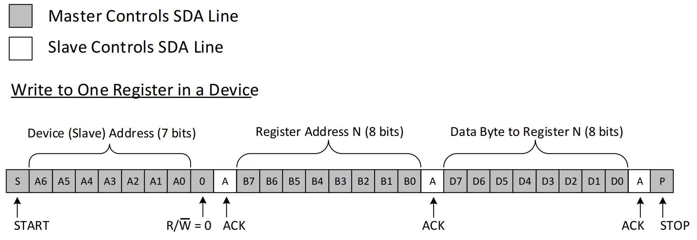  
写入从机寄存器：先发送从机地址和寄存器地址，再紧跟着发送数据。数据以 MSB 优先的方式传输。

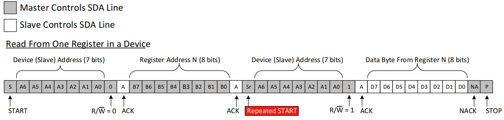  
读取从机寄存器：先通过发送模式传输数据（从机地址和寄存器地址），再进入接收模式接收数据。数据以 MSB 优先的方式传输。

### 数据的传输
数据以 MSB 优先的顺序进行传输。每个字节的传输，占用 9 个时钟周期，前 8 个时钟周期用于确定数据的时序，第 9 个周期用于应答信号。  

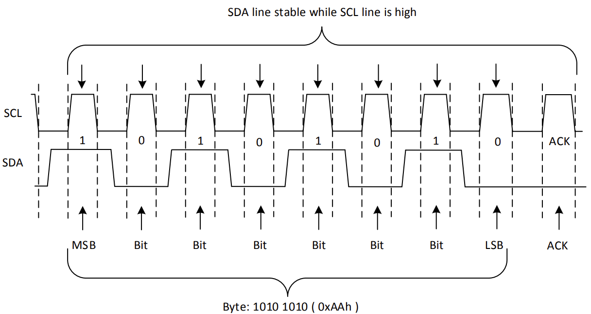

### 启停信号
I2C 通信的开始和结束，都由主机发出 START 和 STOP 信号。  
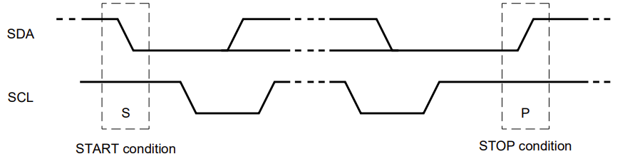  

- START（启动）信号：SCL 为 HIGH 时，SDA 从 HIGH 变为 LOW
- STOP（停止）信号：SCL 为 HIGH 时，SDA 从 LOW 变为 HIGH

通常 I2C 的每次传输都以 START 信号开始，传输完成之后发送 STOP 信号。但 I2C 读取数据的逻辑是：先发送数据标明要读取的内容，再读信号，最后读取数据。由于写和读的操作是单独的传输过程，故需要发送 STOP + START 信号。但 I2C 是多主机多从机系统，在 STOP 和 START 的过程中，可能被其他主机抢占总线，故 I2C 设计了 RESTART 信号，用于在不释放总线的情况下，发送第二次 START 信号。

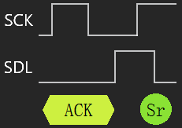

- RESTART（重启动）信号：SCL 由 HIGH 变为 LOW，SDA 从 LOW 变为 HIGH，SCL 再由 LOW 变为 HIGH，SDA 从 HIGH 变为 LOW

### 应答和非应答信号
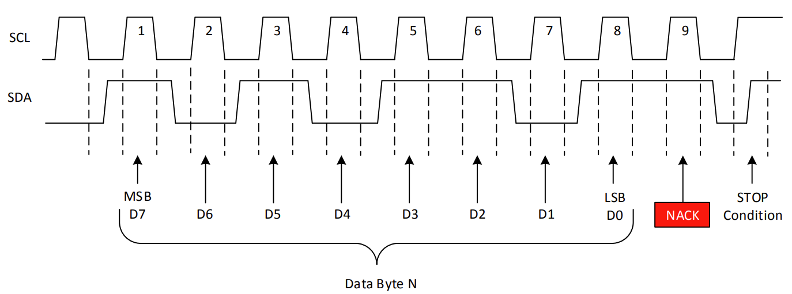  

在传输数据的环节，每个字节会使用 9 个时钟周期，前 8 个时钟周期用于确定数据的时序，第 9 个周期用于检测应答信号。

应答信号（ACK）由接收端发出，当接收到数据后，会在第 9 个时钟周期的下降沿，将 SDA 线拉低，表示接收到数据。如果发送端在第 9 个时钟周期的下降沿，检测到 SDA 线为高电平（NACK），则表示接收端没有接收到数据，发送端会停止传输，并发送 STOP 信号。

出现 NACK（高电平）的情况：

- 没有从机处理该地址（上拉电阻提供了默认的 NACK）
- 从机拒绝接收数据或接收出错
- 主机主动发送 NACK（主机在接收模式时，告知从机停止发送）

当主机打算发送多个字节时，如果收到 NACK，应立即停止发送并发出 STOP 信号。

### 总线仲裁（多主机系统）
#### 时钟（SCL）同步
由于线与特性，SCL 仅当所有主机都将 SCL 线拉高时，才能输出高电平，否则 SCL 线为低电平。这使得多个节点同时发送时钟信号时，在总线上表现出统一的时钟信号。  
当 A、B 主机先后拉低 SCL 线后，先拉低 SCL 线的主机 A 会先试图拉高 SCL 线。由于线与特性，SCL 仍然保持低电平，此时 A 将进入等待状态，直到 B 释放 SCL 线，完成时钟同步。

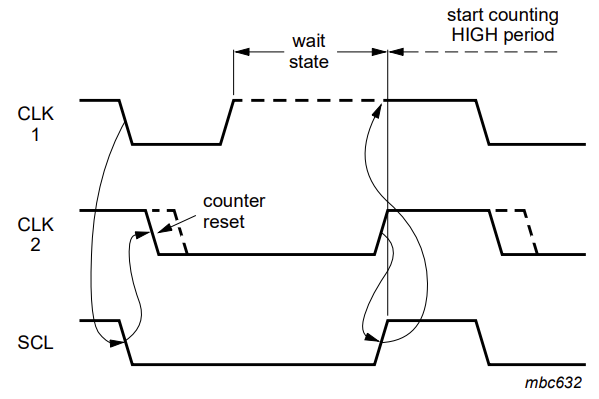

p.s. 根据标准，从机页可以主动拉低 SCL 线，延长主机的时钟周期，从而延长自己的处理时间。其原理与多主机间的时钟同步相同。（用得极少）

#### 数据（SDA）仲裁
节点在发送 1 位数据后，比较总线上所呈现的数据与自己发送的是否一致。是则继续发送；否则检测到冲突，立即停止发送数据（不需要发送 STOP 信号）。

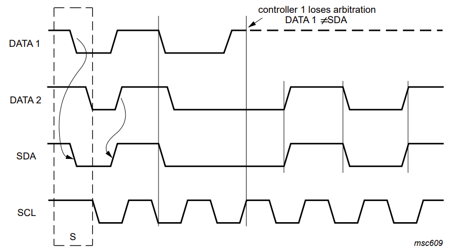

局限性：以下三种情况的冲突的后果是未定义的：

- 设备 1 发送 RESTART 信号，设备 2 传输了一个数据比特
- 设备 1 发送 STOP 信号，设备 2 传输了一个数据比特
- 设备 1 发送 RESTART 信号，设备 2 发送 STOP 信号

## HAL 库中的 I2C 使用方法（主机）
=== "堵塞式"
    ```cpp
    uint8_t data[2];

    // 写入 I2C 设备的内存，发送的数据为 内存地址（此处为 8 bits，0x00）+ 数据
    HAL_I2C_Mem_Write(&hi2c1, 0x78, 
        0x00, I2C_MEMADD_SIZE_8BIT, 
        data, 2, HAL_MAX_DELAY);
    // 读取 I2C 设备的内存，发送的数据为 内存地址（此处为 16 bits，0x0000），
    // 然后发送 RESTART 信号进入接收模式，接收的数据为 2 个字节
    HAL_I2C_Mem_Read(&hi2c1, 0x79, 
        0x0000, I2C_MEMADD_SIZE_16BIT, 
        data, 2, HAL_MAX_DELAY);

    // 发送
    HAL_I2C_Master_Transmit(&hi2c1, 0x78, data, 2, HAL_MAX_DELAY);
    // 接收
    HAL_I2C_Master_Receive(&hi2c1, 0x79, data, 2, HAL_MAX_DELAY);
    ```

=== "中断式（非堵塞）"
    ```cpp
    // 参数与堵塞式类似，除了没有最后一个参数 `Timeout`。

    // 使用中断
    HAL_I2C_Mem_Write_IT();
    HAL_I2C_Mem_Read_IT();
    HAL_I2C_Master_Transmit_IT();
    HAL_I2C_Master_Receive_IT();

    // 回调
    void HAL_I2C_MasterTxCpltCallback(I2C_HandleTypeDef * hi2c);
    void HAL_I2C_MasterRxCpltCallback(I2C_HandleTypeDef * hi2c);
    void HAL_I2C_MemTxCpltCallback(I2C_HandleTypeDef * hi2c);
    void HAL_I2C_MemRxCpltCallback(I2C_HandleTypeDef * hi2c);
    void HAL_I2C_ErrorCallback(I2C_HandleTypeDef * hi2c);
    ```

=== "DMA（非堵塞）"
    ```cpp
    // 参数与堵塞式类似，除了没有最后一个参数 `Timeout`。

    // 使用 DMA
    HAL_I2C_Mem_Write_DMA();
    HAL_I2C_Mem_Read_DMA();
    HAL_I2C_Master_Transmit_DMA();
    HAL_I2C_Master_Receive_DMA();

    // 回调
    void HAL_I2C_MasterTxCpltCallback(I2C_HandleTypeDef * hi2c);
    void HAL_I2C_MasterRxCpltCallback(I2C_HandleTypeDef * hi2c);
    void HAL_I2C_MemTxCpltCallback(I2C_HandleTypeDef * hi2c);
    void HAL_I2C_MemRxCpltCallback(I2C_HandleTypeDef * hi2c);
    void HAL_I2C_ErrorCallback(I2C_HandleTypeDef * hi2c);
    ```

### 参考资料
- [Understanding the I2C Bus](https://www.ti.com/lit/an/slva704/slva704.pdf)
- [I2C-bus specification and user manual](https://www.nxp.com/docs/en/user-guide/UM10204.pdf)