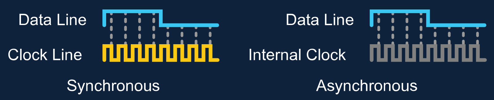

# 串行协议的时序
通信协议是指双方实体完成通信或服务所必须遵循的规则和约定。通信协议包括数据格式、同步方式、传输速度、传输步骤、检纠错方式以及控制字符定义等问题的统一规定。通信协议有很多种，例如 UART、RS232、RS485、TTL、CAN总线、I2C、SPI 等。这些协议各有其不同特性、时序逻辑要求。  

串行通信（Serial Communication）是指在数据通道上，每次传输一个比特数据，并连续进行以上单次过程的通信方式。本文主要介绍串行通信协议在传输过程中的时序逻辑要求。

## 串行信号的比特序
串行信号的比特序有两种：MSB 优先和 LSB 优先。

- MSB 优先：最高位先传输，最低位最后传输。
- LSB 优先：最低位先传输，最高位最后传输。

如传输字节 $(01010101)_2$，MSB 优先和 LSB 优先的传输过程如下：

|    MSB First    |    LSB First    |
| :-------------: | :-------------: |
| 0 1 0 1 0 1 0 1 | 1 0 1 0 1 0 1 0 |

## 串行信号的时钟
串行信号的传播是通过在时域上复用数据线实现的。即，通过时间的先后顺序，分别在同一根数据线上传输不同的数据，这些数据组合起来构成完整的数据。

如传递数据 $(01010101)_2$，使用下图表示的串行信号传播过程（采用单极性不归零码，MSB 优先比特序）：  

问题，如果要传递 $(11110000)_2$：  
  
如何区分这个信号是 $(10)_2$、$(1100)_2$、$(111000)_2$、$(11110000)_2$ 甚至是 $(1111100000)_2$ 呢？

为了解决这个问题，我们需要在传播过程中，使用一些特殊的信号来指示数据线上每个位的时序。通常而言，我们有两种方法来指示数据线上每个位的时序：

- 异步：双方提前约定具体的传输速率。各自使用一个高精度内部时钟来指示数据线上每个位的时序。（比如 UART 协议）
- 同步：增加一根数据线，传输时钟信号，用来指示数据线上每个位的时序。双方根据时钟信号在确切的时间进行读写。（比如 SPI 协议、I2C 协议）

## 异步与同步协议的优缺点
异步协议需要的通信线路较少，因此产生的电磁噪声也较小，自身抗干扰能力也较强。对于中长距离的通信，异步协议更为适用。

异步协议需要双方具有高精度时钟，且需要额外的机制来进行时钟同步，以防止因为时钟误差而导致数据传输错误。
例如，本来想发送 10 个 1，假定双方的时钟信号有 1% 的误差，那么接收端可能会认为接收到 9 个 1，或者 11 个 1。  
  
为此，需要在传输过程中，使用一些特殊的信号来同步双方的时钟信号。这些信号会占用数据线上的一些位，因此异步协议的有效数据传输率会比同步协议低。  

=== "UART 协议"
    每个字节的数据，会在前后各加一个起始位和一个停止位，用来同步双方的时钟信号。
    

=== "CAN 总线"
    当 CAN 节点发送逻辑电平相同的 5 bits 时，它必须发送 1 bit 相反电平（接收器会自动去除）。  
    

同步协议的双方不提前约定传输速率。当然，受限于硬件结构设计，时钟信号的频率范围需要在对端可接受的范围内。

同步协议需要的通信线路较多，因此产生的电磁噪声也较多，自身抗干扰能力也较弱。常用于短距离的板内通信。

## 参考资料
- [Synchronous vs Asynchronous Protocols](https://www.labcenter.com/blog/sim-synch-asynch-protocols/)