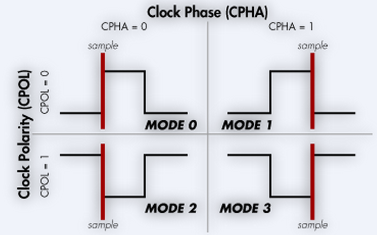

# SPI 协议
## SPI 协议简介
SPI（Serial Peripheral Interface）是一种同步的串行通信协议，由 Motorola 公司在 1980 年代提出，用于芯片间通信。SPI 协议是一种主从式的通信协议，主设备可以同时控制多个从设备，但每个从设备只能被一个主设备控制。SPI 协议的主要特点是通信速度快，但通信线路较多，常用于短距离的板内通信。  

SPI 通信必须由主机发起通信（无论是发送还是接收），从机被动接受。从机不能主动发送数据。  

## SPI 接口形式
SPI 接口有如下几个引脚：

- SCLK（Serial Clock）：时钟信号
- MOSI（Master Output / Slave Input）：主设备输出、从设备输入
- MISO（Master Input / Slave Output）：主设备输入、从设备输出
- CS（Chip Select）：片选信号，用于选择从设备

**此处只讨论标准 SPI，不讨论 Dual SPI、Qual SPI 等扩展协议。**

## SPI 时序
### 片选信号
SPI 传输过程中，输出 CS 为低电平，选择从设备。从设备只有在 CS 为低电平时，才会响应主设备的时钟信号。

在多个从设备的情况下，可以使用多个 CS 引脚，每个 CS 引脚对应一个从设备。在每次传输开始前，主设备需要先拉低对应的 CS 引脚，然后再传输数据。传输结束后，主设备需要拉高对应的 CS 引脚，释放从设备。

在单个从设备的情况下，可以直接将从设备的 CS 引脚接地，省去了主设备控制 CS 引脚的步骤。也可以使用硬件 NSS 信号作为从设备的 CS 引脚。

### 协议参数
SPI 协议的主要参数有：

- 时钟极性（CPOL，Clock Polarity）：时钟空闲状态为高电平还是低电平
- 时钟相位（CPHA，Clock Phase）：数据在时钟的第一个边沿采样还是第二个边沿采样
- 时钟频率（SCLK，Serial Clock）：时钟信号的频率
- 传输顺序：MSB 优先还是 LSB 优先

### SPI 时序实例
MSB 优先，SPI Mode 0（CPOL=0，CPHA=0）  


### 时钟信号
SPI 时钟信号由主设备产生，从设备被动接收。时钟信号仅在传输数据时使用，空闲状态会维持在高电平或低电平（由时钟极性决定）。  
CPOL=0 时，时钟空闲状态为低电平；CPOL=1 时，时钟空闲状态为高电平。

### 数据信号
数据信号在时钟信号的边沿采样，具体第一边沿还是第二边沿由时钟相位决定。   
CPHA=0 时，数据在时钟的第一个边沿采样；CPHA=1 时，数据在时钟的第二个边沿采样。

数据的比特序分为 MSB 优先 和 LSB 优先两种，双方需要提前约定。

### SPI 模式
SPI 模式号是 CPOL 和 CPHA 的组合，一共有四种模式：

- Mode $0=(00)_2$：CPOL=0，CPHA=0
- Mode $1=(01)_2$：CPOL=0，CPHA=1
- Mode $2=(10)_2$：CPOL=1，CPHA=0
- Mode $3=(11)_2$：CPOL=1，CPHA=1



### HAL 库中的 SPI 使用方法（主机）
=== "堵塞式"
    ```cpp
    uint8_t data[128];
    // 发送数据
    HAL_SPI_Transmit(&hspi1, data, 128, HAL_MAX_DELAY);
    // 接收数据（全双工模式下：发送一些不确定的数据，接收从设备返回的数据）
    HAL_SPI_Receive(&hspi1, data, 128, HAL_MAX_DELAY);
    // 边发送边接收
    HAL_SPI_TransmitReceive(&hspi1, tx_data, rx_data, 128, HAL_MAX_DELAY);
    ```

=== "中断式（非堵塞）"
    ```cpp
    // 由于 SPI 的发送速率较快，中断模式下每发送一个 Byte 都要触发一次中断
    // （发送更长数据时，HAL 库内部会处理相关中断，直到最后一次中断调用回调函数），
    // 故使用此方法会非常频繁地使 MCU 响应中断，这可能破坏正常的运行流程，
    // 故 SPI 传输通常不使用中断模式。
    // 确需要非堵塞传输的，应当优先考虑使用 DMA 模式

    // 发送数据
    HAL_SPI_Transmit_IT(&hspi1, data, 128);
    // 接收数据（全双工模式下：发送一些不确定的数据，接收从设备返回的数据）
    HAL_SPI_Receive_IT(&hspi1, data, 128);
    // 边发送边接收
    HAL_SPI_TransmitReceive_IT(&hspi1, &tx_data, &rx_data, 128);

    // 常用中断回调函数
    void HAL_SPI_TxCpltCallback(SPI_HandleTypeDef *hspi); // 发送完成
    void HAL_SPI_RxCpltCallback(SPI_HandleTypeDef *hspi); // 接收完成
    void HAL_SPI_TxRxCpltCallback(SPI_HandleTypeDef *hspi); // 发送接收完成
    void HAL_SPI_ErrorCallback(SPI_HandleTypeDef *hspi); // 发生错误
    ```

=== "DMA（非堵塞）"
    ```cpp
    // 发送数据
    HAL_SPI_Transmit_DMA(&hspi1, data, 128);
    // 接收数据（全双工模式下：发送一些不确定的数据，接收从设备返回的数据）
    HAL_SPI_Receive_DMA(&hspi1, data, 128);
    // 边发送边接收
    HAL_SPI_TransmitReceive_DMA(&hspi1, tx_data, rx_data, 128);

    // 常用中断回调函数
    void HAL_SPI_TxCpltCallback(SPI_HandleTypeDef *hspi); // 发送完成
    void HAL_SPI_RxCpltCallback(SPI_HandleTypeDef *hspi); // 接收完成
    void HAL_SPI_TxRxCpltCallback(SPI_HandleTypeDef *hspi); // 发送接收完成
    void HAL_SPI_ErrorCallback(SPI_HandleTypeDef *hspi); // 发生错误
    ```
