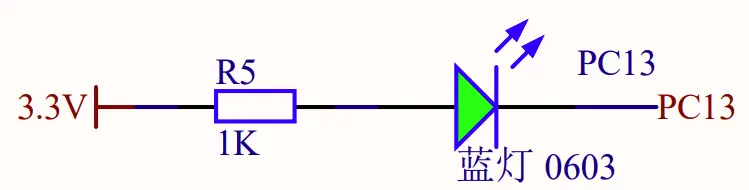
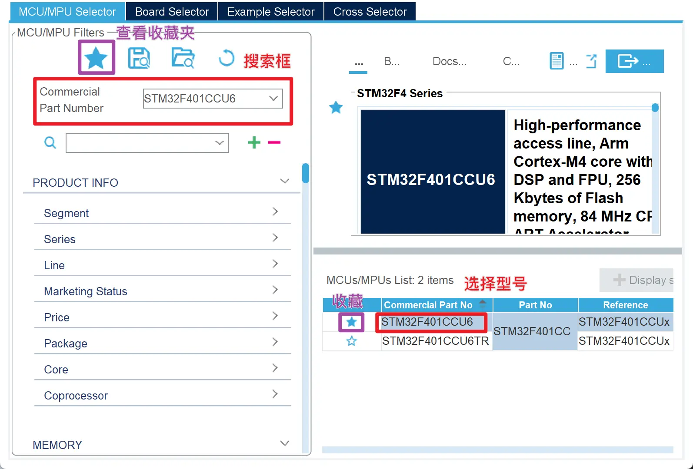
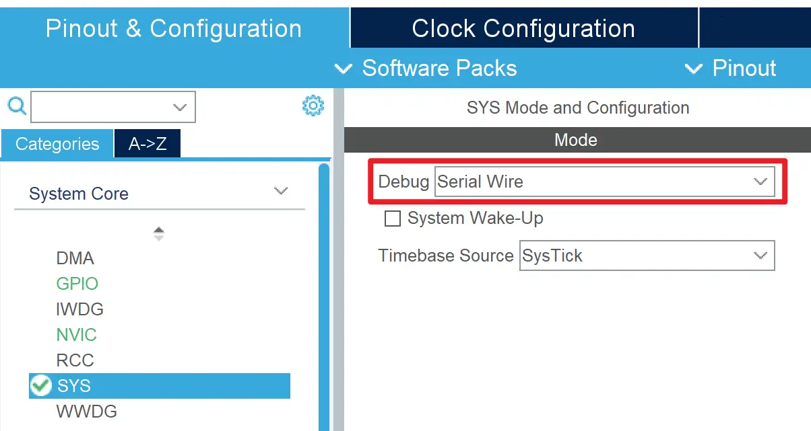
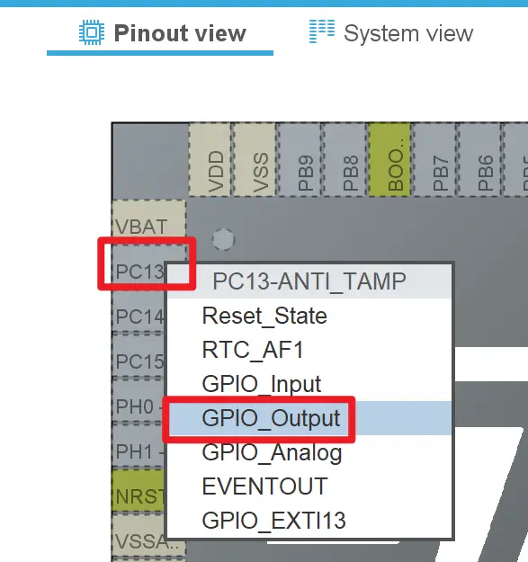
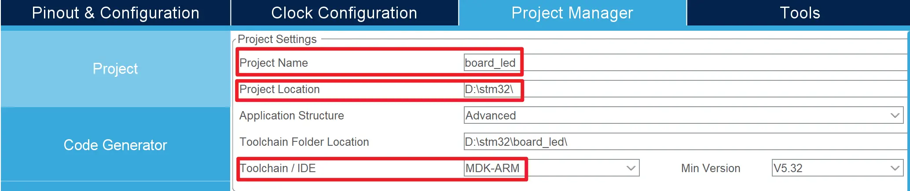
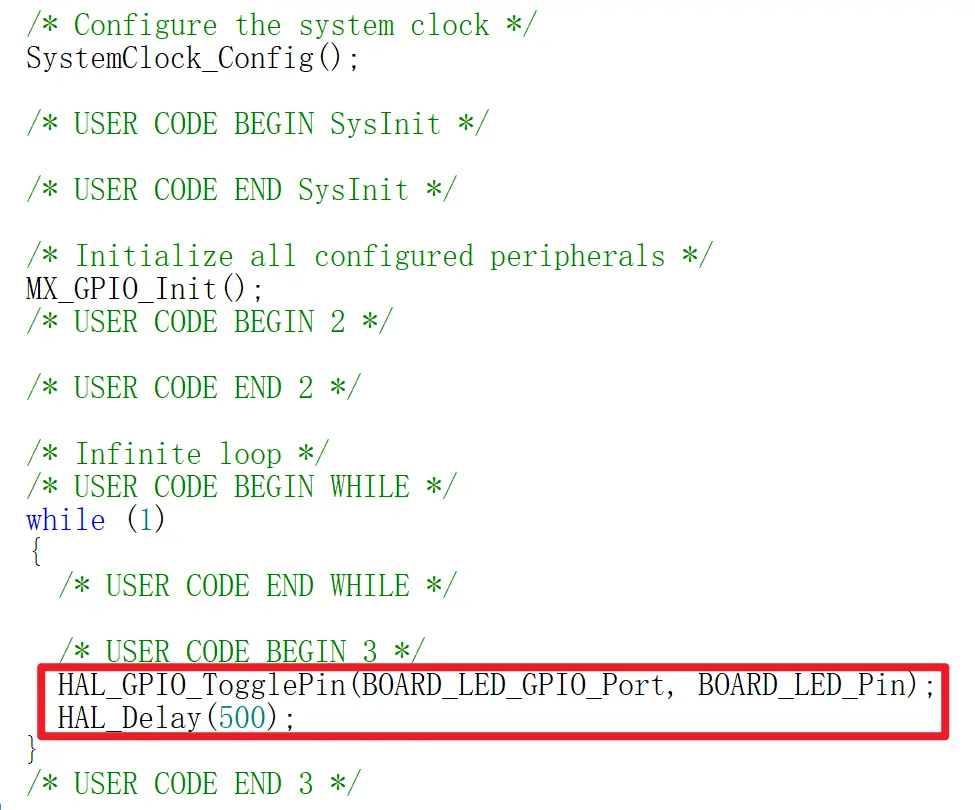

# GPIO 入门：点灯实验
## 逻辑电平
在数字电路中，我们通常有高电平（High）和低电平（Low）两种状态，这是两个不同的电压信号，具体对应的电压值与单片机有关。在 STM32 单片机、ESP32 单片机中，高电平的电压值为 3.3V，低电平的电压值为 0V。

除此之外，还有一个状态叫做高阻态（High Impedance，简称 HiZ），这个状态相当于断路（电阻正无穷），不会流经电流。举例来说，电压表的两个接线柱之间就是一个高阻态，不会流经电流。

单片机对电路的控制，就是通过程序控制单片机的引脚输出高电平、低电平或高阻态，从而控制外部电路的运行状态。而 GPIO（General Purpose Input/Output，通用输入/输出）便是完成这一功能的通用接口。

## 电路设计
为了完成点灯实验，首先，我们需要一个电路，将一个 LED 灯（发光二极管）连接到单片机上。

以 MiniF4 开发板为例，开发板上有一个 LED 灯，串联限流电阻后连接在 C13 引脚上。  

从图中可以看出，LED 灯的两端分别连接到了 C13 引脚和与 3.3V 相连的限流电阻上。

- 当 C13 引脚输出高电平（3.3V）时，LED 两端均为 3.3V（对地电压），LED 灯不会发光
- 当 C13 引脚输出低电平（0V）时，LED 灯会发光。

## 实验操作
1. 打开 STM32CubeMX
2. 点击 「ACCESS TO MCU SELECTOR」，选择您的芯片型号，如 STM32F401CCU6，双击确认  
   
3. 根据您的烧录接口类型，在 SYS 中选择 Debug 接口类型。如您使用 SWD 协议（2 电源线 + 2 烧录通信线）进行烧录，则应该选择 「Serial Write」  
   
4. 如果需要，请根据需要调整时钟参数，或保持默认值（内部时钟源，主频 8MHz）。  
   关于时钟配置的详细说明，可参考[时钟树](../../clock_tree/index.md)一节。
5. 在引脚布局视图（Pinout View），找到 C13 引脚，单击出现菜单，选择类型 「GPIO_Output」  
   
6. 右键 C13 引脚，选择 「Enter User Label」，标注一个自定义名称 「BOARD_LED」（标识符要求与 C 语言变量命名要求类似）
7. 选择 「Project Manager」 选项卡，填写 Project Name（项目名称） 和 Project Location（项目位置），在 Toolchain / IDE 中选择您使用的工具链。

    - 如您使用 Keil 开发，则应当选择 「MDK-ARM」
    - 如您使用 [STM32Tesseract](https://github.com/ArcticLampyrid/stm32tesseract)，则应当选择 「STM32CubeIDE」，并在 STM32Tesseract 程序中转换生成的工程文件。

    

8. 点击右上角蓝色按钮 「GENERATE CODE」
9.  在弹出的对话框中点击 「Open Project」，打开生成的工程文件。
10. 找到并打开 main.c 文件（如果您使用 Keil 环境，应该在 Application/User/Core 组下找到）
11. 在注释 `/* USER CODE BEGIN 3 */` 和 `/* USER CODE END 3 */` 之间插入如图代码：
   
12. 在 IDE 中设置烧录器类型。

    - 如您使用 Keil 环境，应该在 Project -> Options for Target -> Debug -> Use XXX Linker 中选择合的烧录器，默认配置为 ST-Link 烧录器。
    - 如您使用 [STM32Tesseract](https://github.com/ArcticLampyrid/stm32tesseract) 生成了相关工程配置，默认配置为 CMSIS-DAP 烧录器。
    - 如您使用 CLion 环境且手动编写 Launch 配置，则应该编写合适的 OpenOCD 配置文件。

13. 点击 Build 按钮编译工程
14. 将开发板与烧录器连接，并将烧录器与电脑连接，点击 Download / Flash 按钮烧录程序
15. 按下开发板的 RESET（RST） 按键，LED 灯应该会以 0.5 秒的频率闪烁

