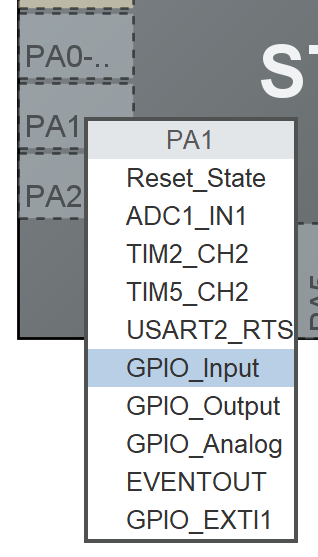
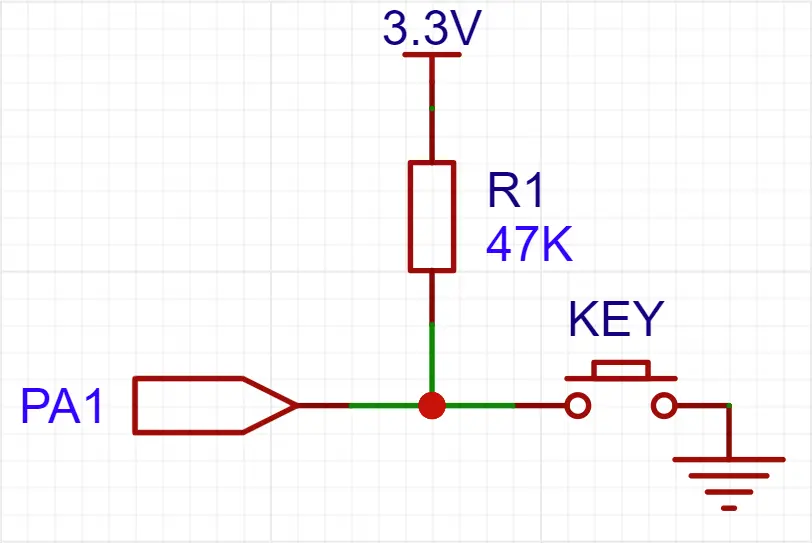
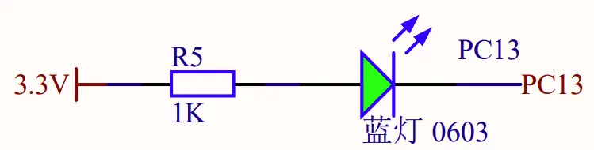

# GPIO 输入
GPIO 是一种通用的输入/输出接口，不仅可以输出逻辑信号改变外部电路的运行状态，还可以读取外界的逻辑信号，并以此为依据改变程序的运行状态。

GPIO 输入模式下，其输入阻抗处于高阻态。

## CubeMX 中配置 GPIO 输出模式


## HAL 库中读取 GPIO 状态的函数

```cpp
// GPIO 逻辑状态有 GPIO_PIN_RESET 和 GPIO_PIN_SET 两种
typedef enum
{
  GPIO_PIN_RESET = 0U,
  GPIO_PIN_SET
} GPIO_PinState;

// 读取 GPIO 逻辑
GPIO_PinState HAL_GPIO_ReadPin(GPIO_TypeDef* GPIOx, uint16_t GPIO_Pin);
```

## 独立按键实验
### 电路设计
做如下电路连接，将按键一端接到 A1 引脚，另一端接 GND。这样，按键按下时，便会使得 A1 引脚与 GND 相连，读取到低电平信号。

但是这样做存在一个问题：当按键不按下时，没有任何电平信号与 A1 引脚连接，此时 A1 处于浮空状态，读取到的逻辑值是一个不确定的、由电磁干扰/热噪声等共同决定的随机值。

为了避免此种情况出现，我们使用一种名为上拉电阻的电路设计，如下图：  


当 GPIO 处于输入模式时，输入抗阻处于高阻态（理想状态为无穷大），故不按下按钮时，可以测得 3V3 高电平信号。当按下按钮后，A1 与 GND 连接读取到低电平信号。此外，此时会有电流流经上拉电阻，但由于上拉电阻阻值极大，只会形成极小的电流，也不会损坏电路或大幅增加功耗。

另外，为了体现实验效果，在 C13 上连接一个 LED 灯珠（如果使用 WeAct Studio 的 MiniF4 系列开发板，则已自带）：  


### 实验操作
1. 按上图搭建相关电路。
2. 打开 CubeMX，选择型号，新建工程。
3. 在引脚视图（Pinout View）单击 PA1，选择 GPIO_INPUT。
4. 在引脚视图（Pinout View）单击 C13，选择 GPIO_OUTPUT。
4. 生成代码，打开工程。
5. 在注释 `/* USER CODE BEGIN 3 */` 后面插入代码：
   ```cpp
   HAL_GPIO_WritePin(GPIOC, GPIO_PIN_13, HAL_GPIO_ReadPin(GPIOA, GPIO_PIN_1));
   ```
6. 编译，烧录，按 RESET（RST） 运行。
7. 应当看到，按下按键时 LED 发光，松开后不发光。
