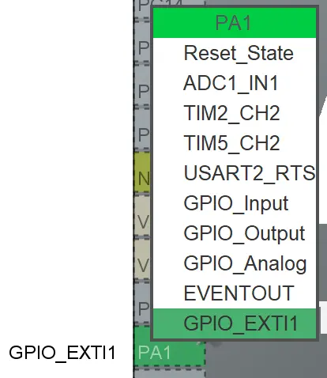
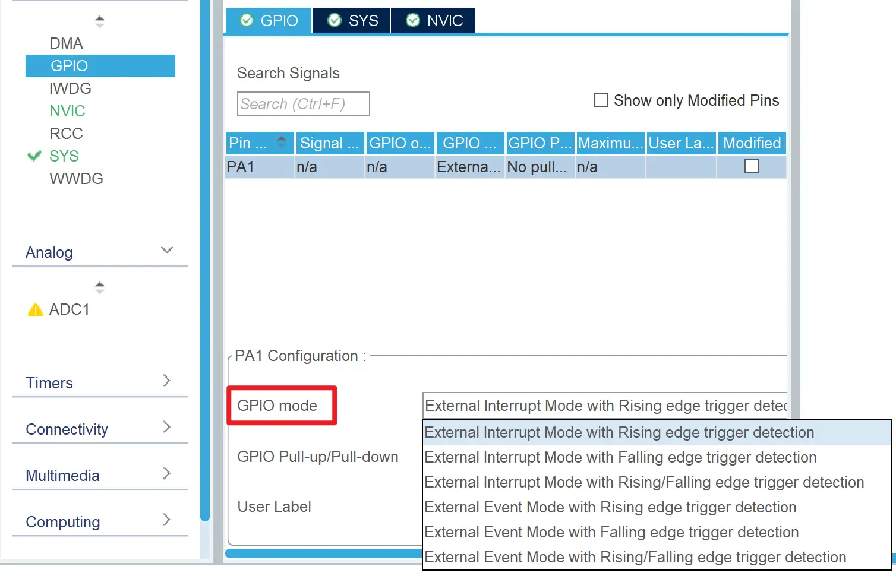
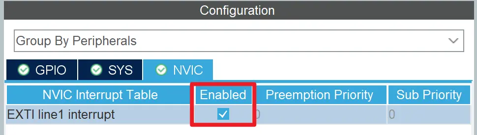

# GPIO 中断
## 简介
当 GPIO 引脚的电平发生变化时，CPU 可以通过中断的方式来感知到这个变化。GPIO 中断可以用于检测外部事件，例如按键按下、传感器采样完成等。

## 中断触发方式
GPIO 中断有以下三种触发方式：

- **External Interrupt Mode with Rising edge trigger detection**  
  在上升沿触发中断
- **External Interrupt Mode with Falling edge trigger detection**  
  在下降沿触发中断
- **External Interrupt Mode with Rising/Falling edge trigger detection**  
  在上升沿或下降沿触发中断

所谓上升沿是指 GPIO 引脚电平从低电平变为高电平的瞬间，下降沿则是指 GPIO 引脚电平从高电平变为低电平的瞬间。

## 在 CubeMX 中配置 GPIO 中断
1. 设置引脚为 GPIO_EXITx （中断或事件）模式  
   
2. 设置中断触发方式  
   
3. 在 NVIC （嵌套中断向量控制器） 中，使能中断  
   

## 使用 HAL 库响应 GPIO 中断
CubeMX 应当自动生成中断处理的底层代码，我们只需要新建一个 `HAL_GPIO_EXTI_Callback` 函数即可。当 GPIO 中断被触发时，该函数将会被自动调用：

```c
void HAL_GPIO_EXTI_Callback(uint16_t GPIO_Pin)
{
    // 通过 GPIO_Pin 参数判断引脚
    // 如 A1/B1/... 触发中断，则 GPIO_Pin == GPIO_PIN_1
}
```