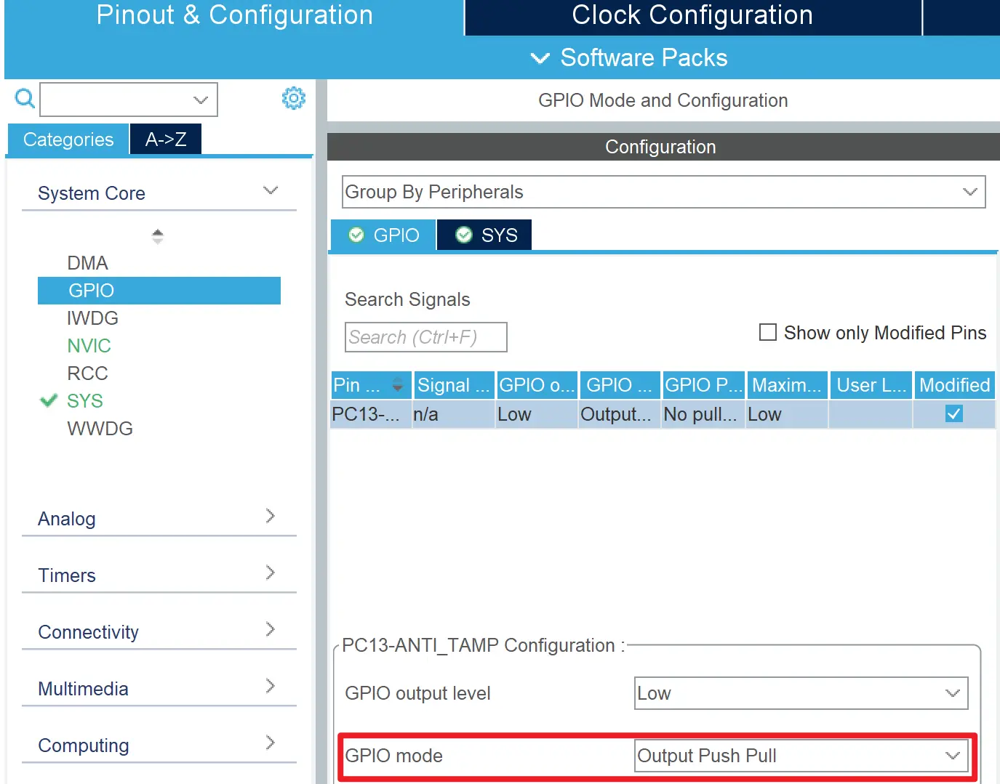
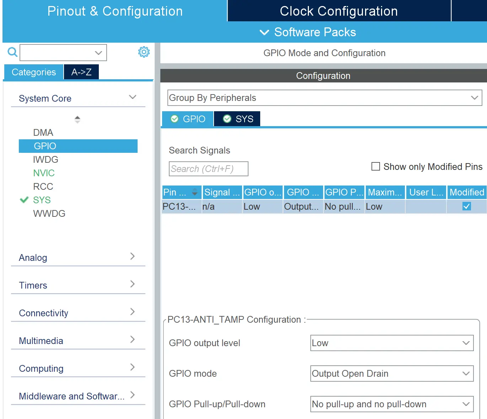

# GPIO 输出
## 逻辑电平
对于单片机的 IO 引脚，其逻辑状态通常可以分为以下几种：

- 高电平（High）：对于 STM32/ESP32 来说为 3.3V。
- 低电平（Low）：通常为 0V。
- 高阻态（High Impedance，简称 HiZ）：相当于断路（电阻正无穷），不会流经电流。

GPIO 输出指通过程序控制单片机的引脚输出高电平、低电平或高阻态，从而将单片机内的逻辑输出到外部电路。如点灯实验中，我们通过输出高电平、低电平来控制 LED 灯的亮灭。

## 推挽输出模式
当配置为推挽输出（Push-pull Output）时，单片机可以输出「低电平」（`GPIO_PIN_RESET`）或「高电平」（`GPIO_PIN_SET`）。输出高电平时，相当于将引脚连接到电源 $V_{dd}$ 上；输出低电平时，相当于将引脚连接到地 $V_{ss}$ 上。

### CubeMX 中配置推挽输出模式
1. 在引脚布局视图（Pinout View），单击需要设置的引脚引脚，在出现的菜单中选择类型 「GPIO_Output」
2. 在 「GPIO」 页面下，选择对应引脚，将 「GPIO mode」 设置为 「Output Push Pull」  
    

???+ "提示"
    通常推挽输出（Push-pull Output）是默认的输出模式，无需手动设置。

## 开漏输出模式
当配置为开漏输出（Open-drain Output）时，单片机可以输出「低电平」（`GPIO_PIN_RESET`）或「高阻态」（`GPIO_PIN_SET`）。输出低电平时，相当于将引脚连接到地 $V_{ss}$ 上；输出高阻态时，相当于将引脚断开。

### CubeMX 中配置开漏输出模式
1. 在引脚布局视图（Pinout View），单击需要设置的引脚引脚，在出现的菜单中选择类型 「GPIO_Output」
2. 在 「GPIO」 页面下，选择对应引脚，将 「GPIO mode」 设置为 「Output Open Drain」  
    

## 读取 GPIO 状态
**在输出模式下，我们仍然可以读取到 GPIO 的外部真实状态为高电平还是低电平**，这在开漏模式下尤为有用。

在开漏模式下，如果输出「高阻态」（`GPIO_PIN_SET`），那么相当于单片机对外部电路没有影响，此时外部电路的电平由外部电路自身决定，而我们可以通过读取 GPIO 的状态来判断外部电路的真实电平状态。

## HAL 库中控制 GPIO 状态的函数
在 STM32 中，GPIO 是分组管理的，每个 GPIO 模块包含多个 GPIO 引脚。例如，GPIOA 模块包含了 A0、A1、A2、A3 等引脚。

在控制 GPIO 时，我们需要指定 GPIO 模块和模块内具体的 GPIO 引脚。  

例如，我们需要控制 A4 引脚，那么我们需要指定 `GPIOA` 模块和 `GPIO_PIN_4` 引脚编号：
```cpp
HAL_GPIO_WritePin(GPIOA, GPIO_PIN_4, GPIO_PIN_SET);
```

HAL 库中控制 GPIO 状态的常用函数如下：
```cpp
// GPIO 逻辑状态有 GPIO_PIN_RESET 和 GPIO_PIN_SET 两种

// 设置 GPIO 逻辑
void HAL_GPIO_WritePin(GPIO_TypeDef* GPIOx, uint16_t GPIO_Pin, GPIO_PinState PinState);
// 读取 GPIO 逻辑
GPIO_PinState HAL_GPIO_ReadPin(GPIO_TypeDef* GPIOx, uint16_t GPIO_Pin);
// 翻转 GPIO 逻辑
void HAL_GPIO_TogglePin(GPIO_TypeDef* GPIOx, uint16_t GPIO_Pin);
```