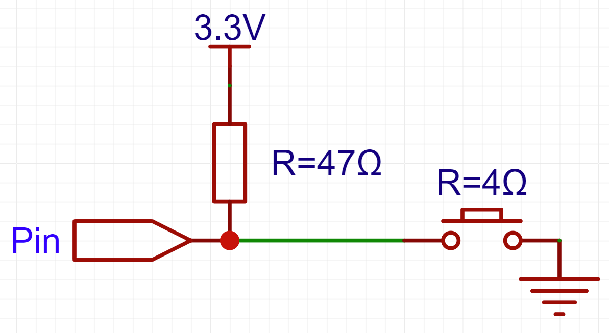

# 上下拉电阻
## 上拉电阻
上拉电阻是用于保证引脚在任何状态下都有确定的电平信号的电阻。对于单片机的 IO 引脚，其逻辑状态通常可以分为高电平（High）、低电平（Low）、高阻态（HiZ）。如当单片机的引脚处于输入状态，且不与外部电路连接时，引脚处于高阻态。上拉电阻用于在引脚处于高阻态时，提供确定的电平信号，将引脚拉高到高电平（High）。

## 下拉电阻
与上拉电阻类似，下拉电阻用于在引脚处于高阻态时，提供确定的电平信号，将引脚拉低到低电平（Low）。

## 上拉电阻阻值的确定
有电阻就有阻值，上拉电阻的阻值一般为 $1 \sim 100\text{kΩ}$，根据实际情况进行调整。下面对阻值过大和过小的一些可能问题进行说明。（下拉电阻同理）

### 阻值过小：灌电流过大
当上拉电阻的阻值过小时，会导致灌电流过大，可能对相关器件造成损坏。同时，会增大功耗。

### 阻值过小：低电平过高
在需要低电平信号时，通常不能认为引脚直接连接到 GND，而是通过了一个较小的电阻。当上拉电阻的阻值过小时，由于串联分压关系，会导致低电平过高，可能会导致相关器件无法正常工作。

???+ "实例：上拉电阻过小导致低电平过高"
    例如，在下图中，低电平将有 0.26V。  
    

### 阻值过大：上升时间过长
任何导体之间都会存在电容，引脚电平的变化需要克服电容的充放电过程，因此引脚电平的变化不是瞬间完成的，而是需要一定的时间。上拉电阻会限制充放电电流，上拉电阻的阻值越大，充放电过程所需的时间越长。可能会导致相关器件无法正常工作。

???+ "实例：I2C 总线"
    在 I2C 总线中，上拉电阻的阻值一般为 $4.7\text{kΩ}$，阻值过大会导致上升时间过长，从而导致 I2C 总线无法正常工作。

## 内置上下拉电阻
在 STM32 中，每个 GPIO 引脚都有内置的上下拉电阻，可以通过 CubeMX 进行配置。在 CubeMX 中，上下拉电阻分为「上拉」和「下拉」两种模式，分别对应「上拉电阻」和「下拉电阻」。

### CubeMX 中配置上下拉电阻
在 「GPIO」 页面下，选择对应引脚，将 「GPIO Pull-up/Pull-down」 设置为 「Pull Up」 或 「Pull Down」  

### 内置上下拉电阻的阻值
在 STM32 中，内置上下拉电阻的阻值一般为 $30 \sim 50\text{kΩ}$（部分提供给 USB 使用的引脚会内置较小的上拉电阻，请参考芯片数据手册），阻值较大，因此不会出现上拉电阻阻值过小导致的问题。但是，阻值较大，因此会导致上升时间过长。比如，内置上拉电阻通常不适合用于 I2C 总线。
