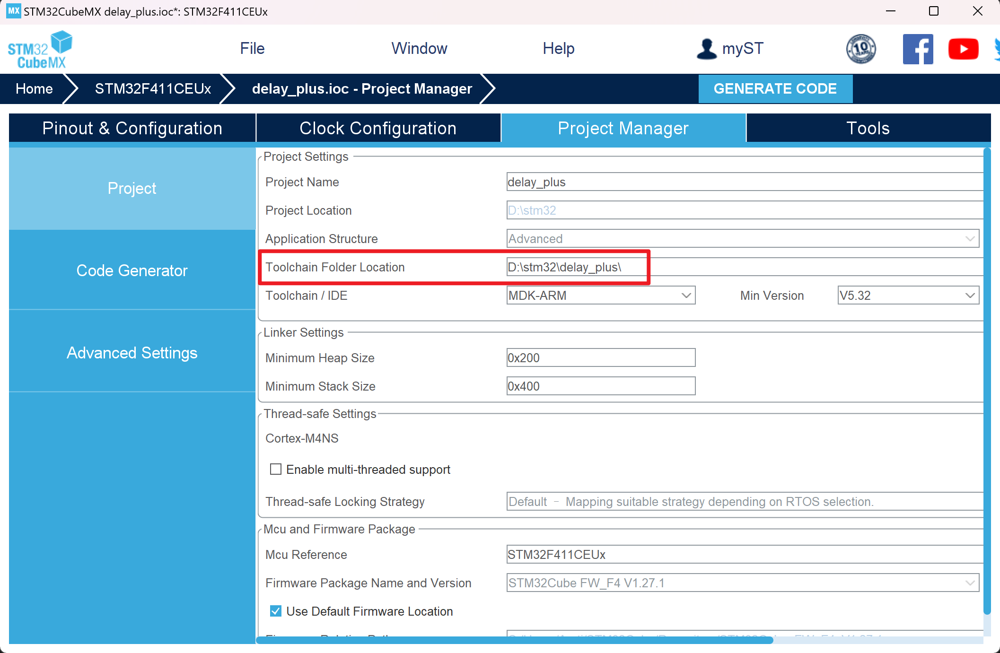
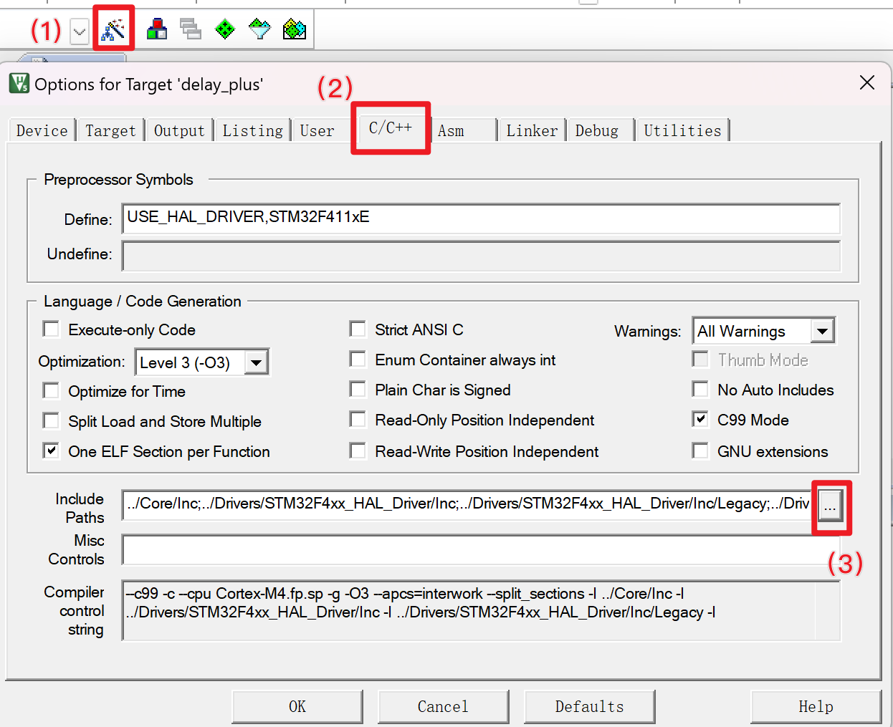
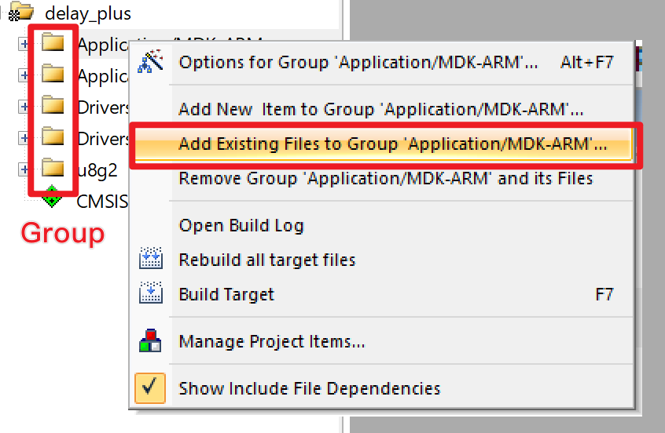

# 多文件项目
## 理论知识
### 多文件编译、链接过程简介
C/C++ 源文件是以 `.c` 或 `.cpp` 为后缀的文件，它们包含了程序的源代码。  
在编译时，每个源文件都将构成一个独立的编译单元（Compilation Unit），被**独立地**编译成一个目标文件（Object File），然后再由链接器将这些目标文件组合起来（学术上叫链接，Link），构成一个可执行文件（Executable File）。  

我们可以在不同的文件中编写代码：
比如在 `my_math.c` 中编写加法函数：
```cpp
int add(int a, int b)
{
    return a + b;
}
```

我们尝试在 `main.c` 中调用加法函数：
```cpp
#include <stdio.h>

int main()
{
    int a = 1, b = 2;
    printf("%d + %d = %d\n", a, b, add(a, b));
    return 0;
}
```

然而，我们在编译时会遇到错误，大意如下：
> 找不到 `add` 函数，或 C99 标准禁止隐式声明函数（禁止调用非声明的函数）

这是因为，编译器在编译 `main.c` 时，只会编译 `main.c` 中的代码（作为独立的编译单元），而不会去查找其他文件中的代码。
因此，我们需要在 `main.c` 中声明 `add` 函数：
```cpp
#include <stdio.h>

// 声明 add 函数
int add(int a, int b);

int main()
{
    int a = 1, b = 2;
    printf("%d + %d = %d\n", a, b, add(a, b));
    return 0;
}
```

这样，编译器就知道 `add` 函数的存在了，能够通过 `main.cpp` 编译出对应的对象文件（在对象文件中，`add` 被标记为外部符号，等待链接时进一步处理）。

最后，链接器将 `main.c` 得到的对象文件和 `my_math.c` 得到的对象文件链接起来，生成可执行文件。

如果我们在 `main.c` 中声明并使用了 `add` 函数，但是在 `my_math.c` 中没有定义 `add` 函数，那么链接器就会报错，大意如下：
> 链接失败：找不到 `add` 符号

上述做法有几个问题：

- 如果有多个文件需要使用 `add` 函数，那么每个文件都需要声明一次 `add` 函数。
- 如果我们修改了 `add` 函数的声明，那么所有使用了 `add` 函数的文件都需要修改。
- 如果在 `my_math.c` 中有很多函数，那么调用方也需要声明很多函数。

这样的做法显然不够优雅。

### 头文件
于是我们引入了头文件（Header File）的概念。  
我们编写文件：`my_math.h`，用于声明 `my_math.c` 中的函数：
```cpp
int add(int a, int b);
```

然后在 `main.c` 中引入头文件：
```cpp
#include <stdio.h>
#include <my_math.h>

int main()
{
    int a = 1, b = 2;
    printf("%d + %d = %d\n", a, b, add(a, b));
    return 0;
}
```
这样，我们就可以更加优雅地在 `main.c` 中使用 `add` 函数了。

预处理指令 `#include` 是一个简单的包含指令，会将头文件中的内容原封不动地复制到 `#include` 所在的位置，因此本代码和上述不使用头文件的代码是等价的。

### 头文件保护
#### 标准方法
如果我们在 `main.c` 中多次引入 `my_math.h`，那么编译器可能会报错。  
（通常我们不会直接多次引入，但是在实际开发中，可能会出现间接多次引入的情况，比如 `main.c` 引入了 `a.h` 和 `my_math.h`，而 `a.h` 又引入了 `my_math.h`）


为了解决这个问题，我们通常在头文件中加入头文件保护：
```cpp
#ifndef MY_MATH_H // ifndef 是 if not defined
                  // 如果 MY_MATH_H 没有被定义

#define MY_MATH_H // 那么就定义 MY_MATH_H

// 实际代码放在 #ifndef 和 #endif 之间
int add(int a, int b);

#endif // 如果结束
```

这样，如果 `my_math.h` 已经被引入，那么 `MY_MATH_H` 就已经被定义了，因此 `#ifndef` 之后的代码就不会被编译。  
注意，实际使用时需要取一个合理的唯一名称（替代本例的 `MY_MATH_H`），保证不会和其他头文件的头文件保护名字冲突。

#### 非标准方法
在一些编译器中，可以通过在头文件的第一行添加 `#pragma once` 来代替头文件保护，表示这个文件只有当前编译单元中第一次被 `#include` 时有效，其它时候将被忽略：
```cpp
#pragma once

int add(int a, int b);
```

注意到，这种方法不是标准的 C/C++ 语法。不过由于其简洁性，仍被广泛使用，并被几乎所有的主流编译器所支持。

### 头文件目录（Include Paths）
在上述例子中，我们使用了 `#include <my_math.h>` 来引入头文件。  
`#include` 有两种形式：

- `#include <header>`：在构建系统规定的标准头文件目录中查找头文件
- `#include "header"`：先在当前文件所在目录中查找头文件，如果找不到再在构建系统规定的标准头文件目录中查找头文件

在大型项目中，我们通常会将头文件和源文件分开存放，比如：
```
project
├── include
│   └── my_math.h
└── src
    ├── main.c
    └── my_math.c
```

为了能够在 `main.c` 中能通过引入 `#include <my_math.h>`，我们需要将 `project/include` 目录添加到头文件目录中。  


## 操作实践
### CubeMX 生成的工程文件的目录结构
**所有正式项目都是多文件的，以目录（文件夹）为单位，而非文件为单位**

CubeMX 生成的工程保存在如下目录：


CubeMX 生成的工程目录的结构如下：
```
project
├── Core
│   ├── Inc
│   │   ├── xxx.h
│   │   ├── xxx.h
│   │   └── xxx.h
│   ├── Src
│   │   ├── xxx.c
│   │   ├── xxx.c
│   │   └── xxx.c
├── Drivers
│   ├── CMSIS
│   └── STM32F4xx_HAL_Driver
├── MDK-ARM
│   └── xxx.uvprojx  // Keil 工程文件
├── .mxproject
└── xxx.ioc          // CubeMX 工程文件
```

一般来说，如果我们需要修改引脚配置，那么需要打开 `xxx.ioc`，然后再通过 CubeMX 生成代码。如果不需要修改引脚配置，那么我们可以打开 `xxx.uvprojx` ，在 Keil 中编写代码。

如果需要将此项目分享给其它人，请将整个文件夹打包成 zip，然后再分享。只分享 `xxx.ioc` 和 `xxx.uvprojx` 是不够的，这两个文件里面没有代码信息。

如果需要新建文件夹，可以在 `project` 下新建一个 `User` 之类的文件夹，包含自定义的代码，然后遵照下文的操作方法将其加入到 Keil 构建系统中。
```
project
└── User
    ├── Inc
    │   └── my.h
    └── Src
        └── my.c
```

如果不需要新建文件夹，也可以在 `Core/Src` 和 `Core/Inc` 中创建新的源文件或头文件，然后遵照下文的操作方法将其加入到 Keil 构建系统中。


### 头文件目录（Include Paths）
先讲一些非嵌入式的场景：

- 在 GCC 中，可以通过 `-I` 参数来指定头文件目录：
  ```bash
  gcc -I project/include ...
  ```
- 在 Visual Studio 中，可以通过在项目属性中的 `C/C++` -> `常规` -> `附加包含目录` 来添加头文件目录。
- 在 CMake 项目中，可以通过在 `CMakeLists.txt` 中添加 `include_directories(project/include)` 来添加头文件目录。

在嵌入式场景中，如果您使用 Keil MDK 来编译，则需要在 `Options for Target` -> `C/C++` -> `Include Paths` 中添加头文件目录。  


如果您使用 EIDE，可以在 EIDE 面板中添加。

如果您使用的是基于 CMake 的嵌入式开发环境，那么请参照上文中的 CMake 项目的方法，注意：
- 如果您是用 橙子🍊 的小工具 [STM32Tesseract](https://github.com/ArcticLampyrid/stm32tesseract) 生成的 CMake 配置，建议添加到 `CMakeProjectConfig.cmake` 最后面。`CMakeLists.txt` 会在再次生成信息的过程中被自动覆盖。
- 如果您是使用的 CLion 生成的 CMake 配置，请将其添加到 `CMakeLists_template.txt` 最后面。`CMakeLists.txt` 会在再次生成信息的过程中被自动覆盖。


### 多文件编译
在使用构建系统、IDE 进行编译时，构建系统会自动将所有源文件编译成目标文件，然后再由链接器将目标文件链接成可执行文件。**但我们需要告诉构建系统，哪些源文件需要被编译。**

先讲一些非嵌入式的场景：

- 在 Visual Studio 中，可以通过 `项目` -> `添加` -> `现有项` 来添加源文件，或通过 `项目` -> `添加` -> `新建项` 来新建源文件。
- 在 CMake 项目中，可以通过在 `CMakeLists.txt` 中添加 `target_sources(target_name PRIVATE file.c)` 的形式来添加源文件。

在嵌入式场景中，如果您使用 Keil MDK 来编译，可以通过 Group 上的右键菜单 `Add Existing Files to Group` 来添加源文件。为了便于组织，也可以先 `Add Group`，然后再在新建的 Group 上右键菜单 `Add Existing Files to Group` 来添加源文件。  
  
注意：Keil 的 Group 是一种虚拟的分类，不会对应真实的文件夹。由于在 Keil 中直接创建会导致文件夹和 Group 不同步，因此建议在文件夹中创建源文件，然后再通过 `Add Existing Files to Group` 来添加源文件。

如果您使用 EIDE，可以在 EIDE 面板中添加。

如果您使用的是基于 CMake 的嵌入式开发环境，那么请参照上文中的 CMake 项目的方法，注意：

- 如果您是用 橙子🍊 的小工具 [STM32Tesseract](https://github.com/ArcticLampyrid/stm32tesseract) 生成的 CMake 配置，建议添加到 `CMakeProjectConfig.cmake` 最后面。`CMakeLists.txt` 会在再次生成信息的过程中被自动覆盖。
- 如果您是使用的 CLion 生成的 CMake 配置，请将其添加到 `CMakeLists_template.txt` 最后面。`CMakeLists.txt` 会在再次生成信息的过程中被自动覆盖。
