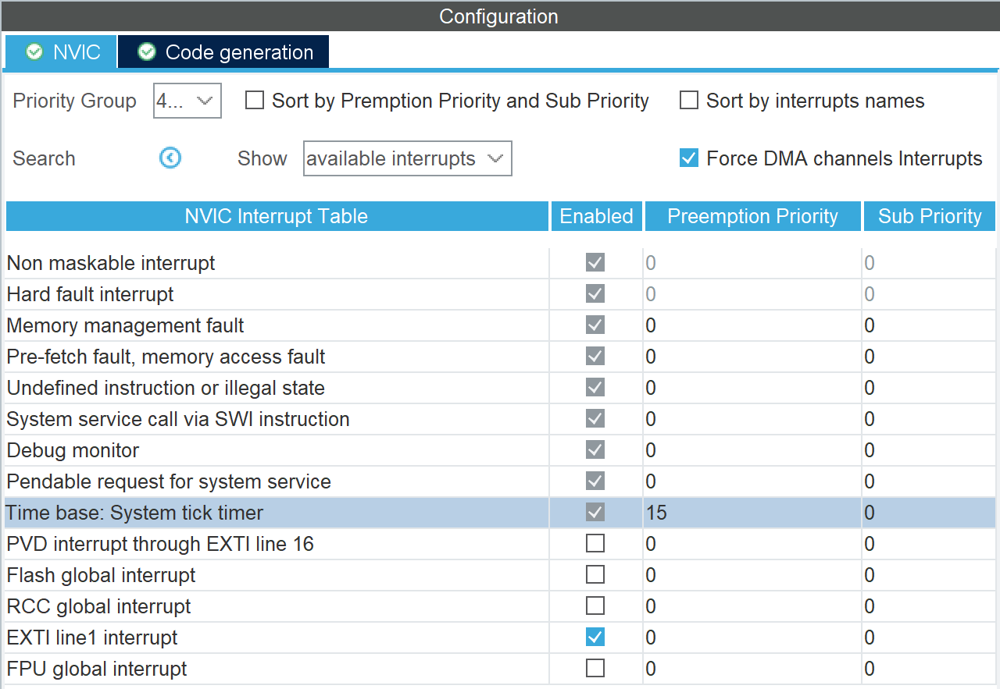

# 在中断中使用延时函数
**通常情况下，中断服务函数中不应该使用延时函数，因为延时函数会占用 CPU 资源，导致中断服务函数无法及时完成，从而影响系统的实时性。**

## 问题描述
如果在中断服务函数中使用 `HAL_Delay` 等延时函数，会发现无法正常工作，程序在 `HAL_Delay` 函数中卡死。

## 原因分析
`HAL_Delay` 函数依赖于 `HAL_GetTick` 函数，而 `HAL_GetTick` 函数又依赖于 SysTick 定时器的中断。默认情况下，SysTick 定时器的中断优先级是最低的，因此会导致 SysTick 定时器的中断无法及时被响应，计时变量一直不变，从而导致 `HAL_Delay` 函数卡死。

## 操作步骤
但是，若有时候我们确实需要在中断服务函数中使用延时函数，那么我们可以使用下面的方法：

1. 打开 CubeMX，切换到 NVIC 配置界面，将 SysTick 中断的优先级设置为较低数值。
2. 将需要用到 `HAL_Delay` 等延时函数的中断的优先级设置为较高数值。

???+ "提示"
    主优先级的数值越小，优先级越高。