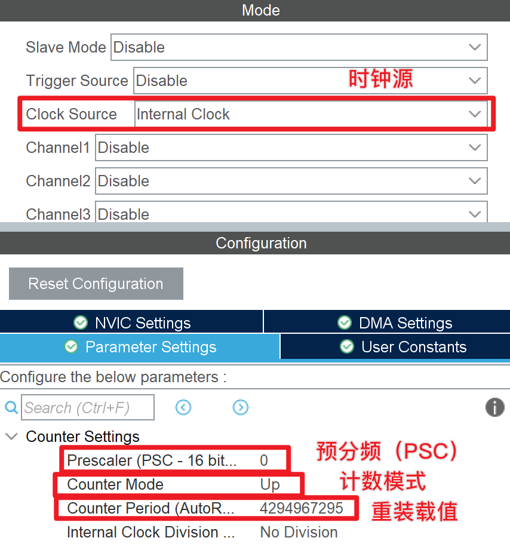
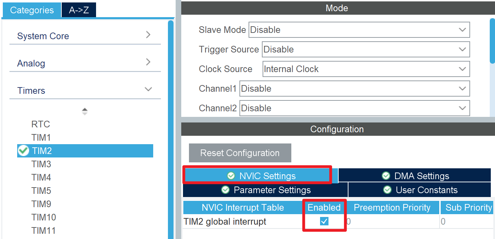

# 定时器基本用法
一切定时器本质都是计数器。单片机的定时器接收一个稳定的时钟信号，并基于此信号进行计数，达到定时的效果。

## 时钟源
定时器的时钟源多种多样，可以来源于单片机内部的时钟，也可以来源于单独的时钟信号，还可以来源于另一个定时器（定时器与定时器串联），最简单的用法自然是使用单片机内部时钟 `Internal Clock`（APBx 总线时钟）。

根据定时器的不同，其内部时钟可能来源于 APB1 或 APB2。以 STM32F4xx 系列为例，TIM1 的内部时钟来源于 APB1，其他定时器的内部时钟来源于 APB2。

## 分频
通常而言，时钟源信号的频率极高且较为固定，在很多情景下并不方便。故而，每个定时器都配备了自己的分频器，以分频的形式获取合适的计数频率。

分配器的分频值由 PSC 寄存器决定，其值为分频值减 1。例如：若 PSC  寄存器的值为 83，则表示 /84 分频。

$$
f=\frac{f_{\text{in}}}{\text{PSC}+1}
$$

???+ "注意"
    计数频率不代表定时器输出的 PWM 波的频率（如果工作在 PWM Generation 模式），更不代表 UPDATE 事件触发频率

## 自动重装载
定时器的“计数”范围是限定的，当数值过大超出这个范围时，就需要进行“重置”，重装载值就描述了这个范围限度。

自动重装载值由 ARR 寄存器决定。

## 计数模式
定时器存在三者基本的计数模式：

### 向上计数模式（Up）
当被时钟信号触发周期性“计数”事件时，若当前计数值（CNT）已经等于自动重装载值（ARR），则重置为 0 并触发 UPDATE 事件；否则，使计数值加 1。

### 向下计数模式（Down）
当被时钟信号触发周期性“计数”事件时，若当前计数值（CNT）已经等于 0，则重置为自动重装载值（ARR）并触发 UPDATE 事件；否则，使计数值减 1。

### 中心对称计数模式（Center-aligned）
在中心对称计数模式下，计数器首先从 0 计数到 ARR-1，然后从 ARR 计数并产生 UPDATE 事件，直到递减到 1，然后回到 0 开始下个周期并触发 UPDATE 事件。

## 在 CubeMX 配置定时器基本参数
在 CubeMX 中，我们可以这样配置定时器的基本参数：  


注意：有些定时器的时钟源仅有内部时钟（Internal Clock），此时只有一个复选框，打勾即可。

## 使用 HAL 库操作定时器
在使用定时器时，我们必须先启动定时器，以便开始计数。在 HAL 库中，我们可以使用以下代码启动定时器：
```c
HAL_TIM_Base_Start(&htim2);
```

我们可以使用 HAL 库来读取定时器的各种信息，例如：
```c
// 获取定时器的计数值
__HAL_TIM_GET_COUNTER(&htim2);
// 获取定时器的自动重装载值
__HAL_TIM_GET_AUTORELOAD(&htim2);
// 获取定时器的分频值
__HAL_TIM_GET_PRESCALER(&htim2);
```

也可以动态修改定时器的各种信息，例如：
```c
// 设置定时器的计数值
__HAL_TIM_SET_COUNTER(&htim2, 0);
// 设置定时器的自动重装载值
__HAL_TIM_SET_AUTORELOAD(&htim2, 1000 - 1);
// 设置定时器的分频值
__HAL_TIM_SET_PRESCALER(&htim2, 84 - 1);
```

## UPDATE 中断
通过配置，我们可以使得 UPDATE 事件发生时产生一个中断，以便周期性地执行某些代码。

以向上计数模式（这是最常用的模式）为例，我们可以根据上文描述算出 UPDATE 中断的触发频率为：
$$
f_{\text{update}}=\frac{f_{\text{in}}}{\text{PSC}+1}\times\frac{1}{\text{ARR}+1}
$$

在 CubeMX 中，我们可以这样开启中断：


在 HAL 库代码中，我们需要使用以下代码启动定时器并使能中断：
```c
// 注意：IT 后缀表示使能中断
HAL_TIM_Base_Start_IT(&htim2);
```

通过 HAL 库的以下回调函数响应中断：
```c
void HAL_TIM_PeriodElapsedCallback(TIM_HandleTypeDef *htim)
{
    if (htim->Instance == TIM2) {
        // do something
    }
}
```
