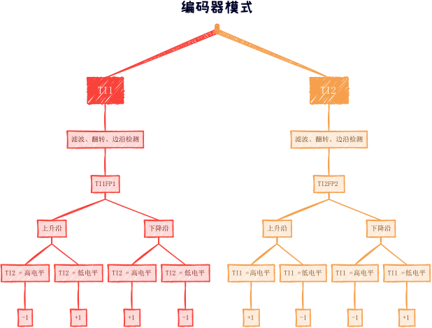
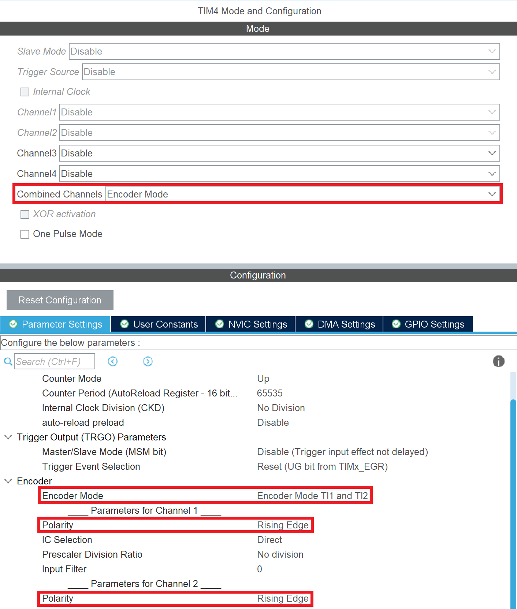

# 增量式编码器模式
## 简介
增量式编码器是指没有绝对位置、只有相对增量的一种旋转位置编码器，可以用于读出旋转量的改变。每当编码器位置改变时，触发一个脉冲，单片机可以对该脉冲做出响应，完成用户交互、电机转速统计等需求。

所谓增量式（相对式）是指，无论编码器的指针位置处于何处，只要改变量相同，则产生的脉冲信号相同。

## 信号形式
标准增量式编码器采用 A/B 相两线制，每次旋转时在 A/B 相上触发脉冲。A/B 相具有 $\frac{\pi}{2}$ 的相位差（即 $\frac{1}{4} T$），根据方向不同 A 相超前 B 相或 A 相滞后 B 相。

## 定时器外设的编码器模式
???+ "提示"
    定时器外设的编码器模式，由硬件完成检测和计数，其计数过程不需要内核参与，可以适用于编码器脉冲数较高的情景。不过，由于定时器资源较为宝贵，对于 EC11 旋钮等脉冲数较低的场景，常使用普通 GPIO 进行读取，然后使用代码进行状态判断和计数工作。


定时器外设提供了专门的编码器模式（Encoder Mode），能够响应编码器的数据并自动识别方向进行计数。

在编码器模式中，首先 TIx （原始信号） 经过滤波和反转（根据配置）得到 TIxFPx，然后在 TIxFPx 的每个边沿进行计数（并根据另一个 TIx 的电平状态判断计数方向）。



在计数时，有三种编码器模式：

- 在 TI1 改变时计数（2 倍频）：Encoder Mode TI1
- 在 TI2 改变时计数（2 倍频）：Encoder Mode TI2
- 在 TI1 和 TI2 改变时均计数（4 倍频）：Encoder Mode TI1 and TI2

不同的模式会导致不同的数据误差和精度。另外，不难看出，使用最后一种模式时，其计数量是前两种模式的两倍，且精度更高。

编码器模式可以看作是一种特殊的外部时钟触发模式（可以根据两线自动判断方向）。

## 在 CubeMX 中配置编码器模式
- 在 Combined Channels 中选择 Encoder Mode
- 根据需要设置编码器模式（Encoder Mode）
- 根据需要选择编码器极性（Polarity）  
  注意：这个参数是选择正方向的，即决定 TIx 和 TIxFPx 是否反相的。无论选择哪个值，**在上升沿和下降沿均会进行计数**。



## 在 HAL 库中使用编码器模式
首先，开启编码器模式下的定时器：

```c
HAL_TIM_Encoder_Start(&htim4, TIM_CHANNEL_ALL);
```

然后，便可以使用 `__HAL_TIM_GET_COUNTER` 函数来读取计数值：

```c
// __HAL_TIM_GET_COUNTER 返回的是无符号数
// 对于编码器的场景，可能有符号数更方便使用，故这里使用了一个强制转换
// 这里假设了 ARR = 65535，故使用 int16_t
// 若 ARR = 4294967295，应使用 int32_t
int16_t value = (int16_t)__HAL_TIM_GET_COUNTER(&htim4);
```

根据需要，合理利用读取到的计数值，如通过串口 `USART2` 打印出来：

```c
char buf[64];
sprintf(buf, "value = %d\r\n", value);
HAL_UART_Transmit(&huart2, (uint8_t *)buf, strlen(buf), HAL_MAX_DELAY);
```