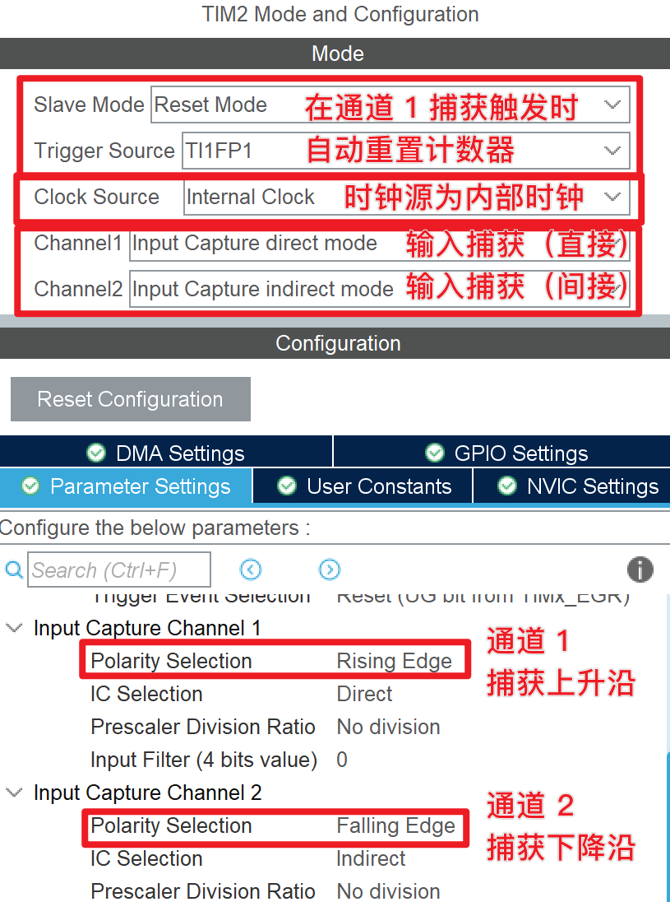
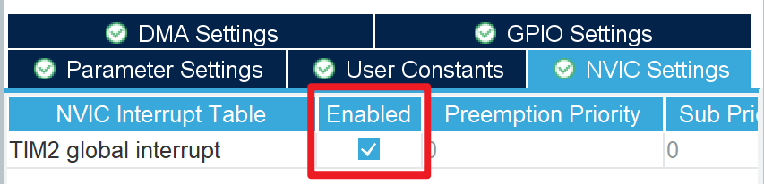
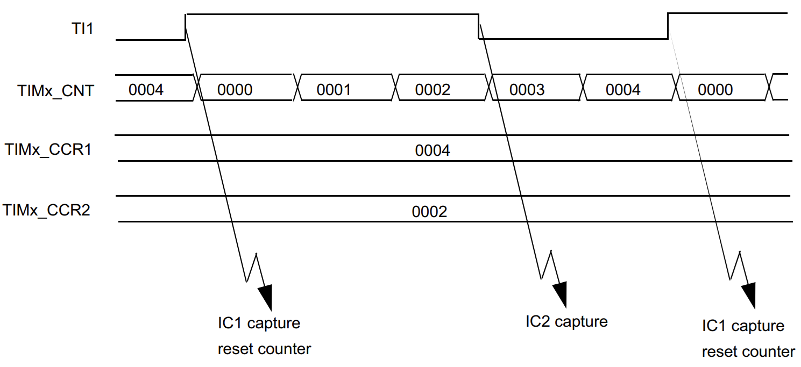

# 输入捕获
## 概述
在 STM32 中，输入捕获是指在定时器在检测到外部信号的上升沿或下降沿时自动触发⌈捕获⌋行为，将当前定时器的计数值保存到捕获寄存器（`CCRx`）中。

输入捕获常用于测量外部信号的频率、脉宽、占空比等。

## 捕获原理
首先配置定时器在合理的计数模式下工作（参见 [定时器基本用法](../basic/index.md)），然后设置相关通道为输入捕获模式，当定时器检测到外部信号的上升沿或下降沿时，会自动将当前定时器的计数值保存到捕获寄存器中，并根据配置触发中断等通知机制。

### 直接与间接输入
捕获通道分为⌈直接（Direct）⌋和⌈间接（Indirect）⌋两种，直接表示从定时器的相应输入引脚获取信号，间接则表示复用另一个通道的信号（用于使用两个通道捕获同一个输入信号）。

通常：

- Channel 1 的间接模式表示复用 Channel 2 的信号
- Channel 2 的间接模式表示复用 Channel 1 的信号
- Channel 3 的间接模式表示复用 Channel 4 的信号
- Channel 4 的间接模式表示复用 Channel 3 的信号。

### 极性选择
Polarity Selection（极性选择）用于选择捕获信号的上升沿还是下降沿。

例如，当极性选择为上升沿时，若定时器检测到输入信号的上升沿，会自动将当前定时器的计数值保存到捕获寄存器中，并根据配置触发中断等通知机制。

### 自动重置
输入捕获常配合 ⌈从模式：重置（Slave Mode：Reset）⌋ 使用，有关从模式的详细介绍请参见 [定时器的从模式](../slave_mode/index.md)。

当设置从模式的触发源为 `TIxFPx` 时，相应通道触发⌈捕获⌋后会自动重置定时器的计数值。

例如，设置通道 1 为上升沿捕获，从模式为 `Reset Mode`，触发源为 `TI1FP1`，当定时器检测到输入信号的上升沿时，会自动将当前定时器的计数值保存到捕获寄存器中，然后将定时器的计数值重置为 0。此时，若输入方波，捕获寄存器的值就是 第 $n$ 次上升沿（捕获值） 到 第 $n-1$ 次上升沿（设置了重置，相当于计数原点） 的计数总量，根据定时器计数频率则可以算出相应方波的周期。

## 在 CubeMX 中配置输入捕获通道
在 CubeMX 中配置输入捕获通道的步骤如下：

- 配置时钟源和定时器的计数模式（参见 [定时器基本用法](../basic/index.md)）
- 配置通道为输入捕获的 Direct 或 Indirect 通道
- 配置相应通道的 Polarity Selection（极性选择） 参数
- 根据需要配置从模式（参见 [定时器的从模式](../slave_mode/index.md)）
- 根据需要配置中断

  


## 在 HAL 库中使用输入捕获通道
首先，开启定时器的输入捕获功能：

```c
// 开启 TIM2 的 Channel 1 的输入捕获功能，并使能中断
HAL_TIM_IC_Start_IT(&htim2, TIM_CHANNEL_1);

// 开启 TIM2 的 Channel 2 的输入捕获功能，不使能中断
// 如果需要使能 Channel 2 的中断，则应改用 HAL_TIM_IC_Start_IT
HAL_TIM_IC_Start(&htim2, TIM_CHANNEL_2);
```

然后，实现相应的中断回调函数：

```c
void HAL_TIM_IC_CaptureCallback(TIM_HandleTypeDef *htim)
{
    if (htim->Instance == TIM2) {
        if (htim->Channel == HAL_TIM_ACTIVE_CHANNEL_1) {
            // Channel 1 的捕获中断

            // 读取 Channel 1 的捕获值
            uint32_t ccr1 = HAL_TIM_ReadCapturedValue(htim, TIM_CHANNEL_1);

            // 读取 Channel 2 的捕获值
            uint32_t ccr2 = HAL_TIM_ReadCapturedValue(htim, TIM_CHANNEL_2);
        }
    }
}
```

在中断中，我们可以使用 `HAL_TIM_ReadCapturedValue` 函数读取捕获寄存器的值。

## 实验：捕获 PWM 波形并测量频率和占空比
???+ "注意"
    笔者所用的芯片为 STM32F401CCU6，其 TIM2 定时器的计数器是 32 位的，因此最大计数值为 4294967295（0xFFFFFFFF）。如果您其它型号的芯片或使用 TIM3 等其它定时器，其可能为 16 位的，最大计数值为 65535（0xFFFF）。

1. 假设已配置系统时钟为 84MHz
2. 配置时钟源为 `Internal Clock`，`PSC` 保持为 0，`ARR` 保持为 4294967295（0xFFFFFFFF）
3. 配置通道 1 为输入捕获（直接）模式：`Input Capture direct Mode`，极性选择（Polairty Selection）为上升沿：`Rising Edge`，
4. 配置通道 2 为输入捕获（间接）模式：`Input Capture indirect Mode`，极性选择（Polairty Selection）为下降沿：`Falling Edge`，
5. 从模式选择为 `Reset Mode`，触发源选择为 `TI1FP1`
6. 在 NVIC Settings 选项卡，勾选 `TIM2 global interrupt`，使能中断
7. 在 `main` 函数中开启定时器的输入捕获功能：
    ```c
    HAL_TIM_IC_Start_IT(&htim2, TIM_CHANNEL_1);
    HAL_TIM_IC_Start(&htim2, TIM_CHANNEL_2);
    ```
    
8. 编写以下中断回调函数：
    ```c
    volatile double duty;
    volatile freq;
    void HAL_TIM_IC_CaptureCallback(TIM_HandleTypeDef *htim)
    {
        if (htim->Instance == TIM2) {
            if (htim->Channel == HAL_TIM_ACTIVE_CHANNEL_1) {
                // 读取 Channel 1 的捕获值
                uint32_t ccr1 = HAL_TIM_ReadCapturedValue(htim, TIM_CHANNEL_1);
                // 读取 Channel 2 的捕获值
                uint32_t ccr2 = HAL_TIM_ReadCapturedValue(htim, TIM_CHANNEL_2);
                // 计算占空比
                duty = ((double)ccr2 + 1) / ((double)ccr1 + 1);
                // 计算频率
                freq = 84000000.0 / ((double)ccr1 + 1);
            }
        }
    }
    ```

9. 根据需要将 `duty` 和 `freq` 显示出来，如通过串口 `USART2` 打印：
    ```c
    char buf[64];
    while (1) {
        sprintf(buf, "freq: %.2f Hz, duty: %.2f%%\r\n", freq, duty * 100);
        HAL_UART_Transmit(&huart2, (uint8_t *)buf, strlen(buf), HAL_MAX_DELAY);
        HAL_Delay(1000);
    }
    ```

???+ "提示：关于 volatile 修饰"
    在上述代码中，我们使用了 `volatile` 修饰 `duty` 和 `freq`，这是因为这两个变量会在中断回调中和中断回调外同时使用，而 `volatile` 将保证所有读写均为真实的内存访问，而非某种本地缓存。
    
    中断是一种强制“跳转”，不属于正常 C/C++ 执行流程，因此在常规的执行流程分析之外。如不标注 `volatile`，可能会被编译器错误地假设某些值不变，导致错误的运行结果。如在上述循环打印至 `USART2` 的代码中，如果不标注 `volatile`，编译器可能错误地认为 `freq` 和 `duty` 的值保持不变（循环打印的代码中确实看不出对 `freq` 和 `duty` 的改变，这两者的改变完全依靠中断回调这种打破正常运行流程的方式），从而不会重新读取其值，导致打印的值不会改变。
    
    有关 `volatile` 修饰的详细介绍请参见 [volatile 修饰](../../volatile_qualified/index.md)。

### 分析捕获过程


### 分析动态范围
在上述实验中，我们的计数频率为 84MHz，我们使用了 32 位的定时器计数器，因此可以测量的最小频率为 0.02 Hz（84MHz / 4294967296）。

如果我们使用 16 位的定时器计数器，继续使用 84MHz 的计数频率，则最小可测频率为 1.282 kHz（84MHz / 65536），在某些情景下可能过大。此时，我们可以调节 `PSC` 来降低计数频率。

