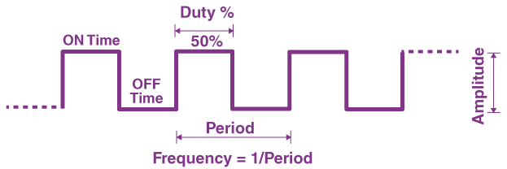
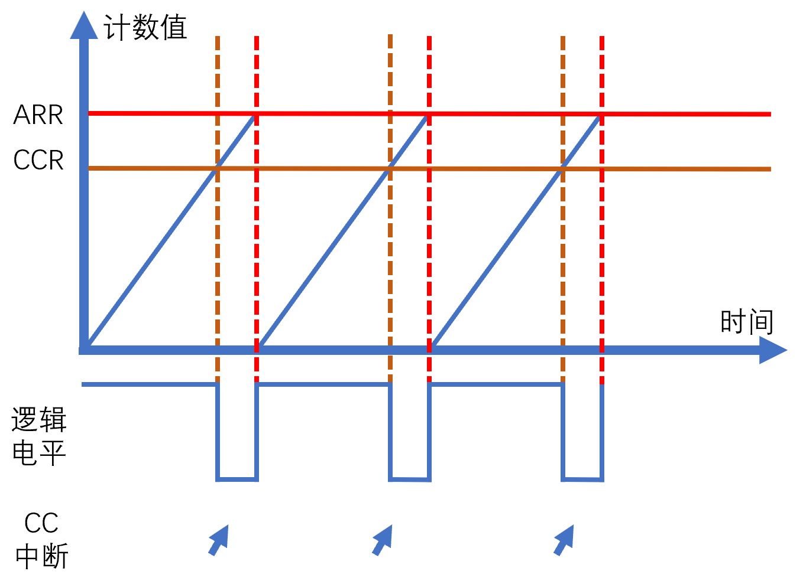
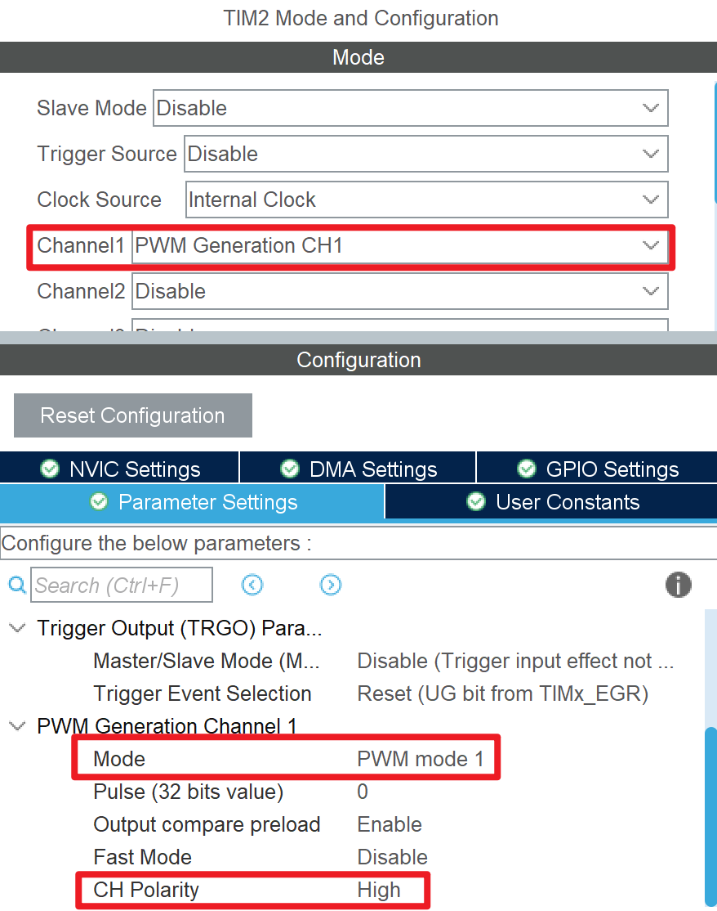

# PWM 生成
## 什么是 PWM？
**PWM 不是控制算法，是调制技术。**

PWM 是脉宽调制（Pulse Width Modulation）的缩写，是一种通过调制信号的占空比来传递连续信息的一种技术。PWM 常用于调整器件的运行功率（电机的转速、LED 的亮度等）或传递模拟数据。

我们知道，数字 I/O 口只能处于高阻态或输出高电平、低电平等离散的、分立的的电压信号。而利用 PWM，我们可以在数字电路中输出连续可变的模拟信息，继而以一种连续可调的方式影响外部电路的运行。

- 为了传输连续可变的模拟数据，我们通过不断改变电平状态来编码相关信息。接收端通过解调来恢复原始的模拟数据。
- 为了调制外部电路的功率，我们通过不断改变电平状态来控制电路的平均功率，以达到功率调制的目的。此种目的中，通常不会有专门的解调电路，或者说功率器件依靠其物理特性，起到⌈解调⌋并执行的作用。



上图为 PWM 调制波的波形图（其中占空比为 50%）。

PWM 调制波形主要有以下参数：

- **占空比（Duty）**：高电平的时间占整个周期的比例，通常用百分比来表示。占空比越大，波的平均功率越大。
- **周期（Periodicity）** 或 **频率（Frequency）**：波形的周期与频率互为倒数。
- **脉宽（Pulse Width）**：高电平的时间长度，等于占空比乘以周期。

## 如何生成 PWM？
在 STM32 中，我们通常通过定时器来生成 PWM。定时器提供了名为 ⌈PWM Generation⌋ 的功能，可以通过自动比较内部计数值来生成 PWM。

### 向上计数模式
当处于向上计数模式、PWM 模式 1 时，定时器的计数值从 0 开始，每计数一次加 1，直到达到设定的⌈自动重装载值⌋。当计数值小于⌈比较值⌋时，输出为⌈有效电平⌋；当计数值大于**等于**⌈比较值⌋时，输出为⌈无效电平⌋。当计数值达到⌈自动重装载值⌋时，计数值会被重置为 0，从而形成一个周期。



易得如下公式：
$$
\begin{aligned}
    \text{PWM 波频率} &= \frac{\text{定时器计数频率}}{\text{自动重装载值} + 1} \\\
    &= \frac{\text{时钟源频率}}{(\text{预分频值}  + 1) \times (\text{自动重装载值} + 1)} \\\
    \text{PWM 波占空比} &= \frac{\text{比较值}}{\text{自动重装载值} + 1}
\end{aligned}
$$

此外，在计数值 `CNT` 递增到与比较值 `CCRx` 相等时，会触发⌈捕获/比较（CC）⌋中断。如果比较值 `CCRx` 大于 `ARR`，则会在发生重装载（Update）时触发⌈捕获/比较（CC）⌋中断。

有效电平和无效电平的电平状态由⌈通道极性（CH Polarity）⌋决定。⌈通道极性⌋为⌈High⌋时，有效电平为高电平；⌈通道极性⌋为⌈Low⌋时，有效电平为低电平。

另有 PWM 模式 2，其输出与 PWM 模式 1 相反（即当计数值小于⌈比较值⌋时，输出为⌈无效电平⌋；当计数值大于**等于**⌈比较值⌋时，输出为⌈有效电平⌋）。

### 向下计数模式
当处于向下计数模式、PWM 模式 1 时，定时器的计数值从⌈自动重装载值⌋开始，每计数一次减 1，直到达到 0。当计数值小于**等于**⌈比较值⌋时，输出为⌈有效电平⌋；当计数值大于⌈比较值⌋时，输出为⌈无效电平⌋。当计数值达到 0 时，计数值会被重置为⌈自动重装载值⌋，从而形成一个周期。**该模式下无法输出 0% 占空比的 PWM。**

易得如下公式：
$$
\begin{aligned}
    \text{PWM 波频率} &= \frac{\text{定时器计数频率}}{\text{自动重装载值} + 1} \\\
    &= \frac{\text{时钟源频率}}{(\text{预分频值}  + 1) \times (\text{自动重装载值} + 1)} \\\
    \text{PWM 波占空比} &= \frac{\text{比较值} + 1}{\text{自动重装载值} + 1}
\end{aligned}
$$

另有 PWM 模式 2，其输出与 PWM 模式 1 相反（即当计数值小于**等于**⌈比较值⌋时，输出为⌈无效电平⌋；当计数值大于⌈比较值⌋时，输出为⌈有效电平⌋）。该模式下无法输出 100% 占空比的 PWM。

### 中央对齐模式
相当于向上计数模式和向下计数模式的结合。另有三种中央对齐模式，其区别在于⌈捕获/比较（CC）⌋中断的触发时机：

- 模式 1（`CMS=01`）：仅在向下计数的区段触发⌈比较⌋中断。
- 模式 2（`CMS=10`）：仅在向上计数的区段触发⌈比较⌋中断。
- 模式 3（`CMS=11`）：在向上计数和向下计数的区段均触发⌈比较⌋中断。

## 在 CubeMX 配置 PWM Generation 通道
1. 配置时钟源和基本参数（预分配值 `PSC`、自动重装载值 `ARR` 等），参见 [基本用法](../basic/index.md)。
2. 在⌈通道配置⌋中，选择⌈PWM Generation CHx⌋，并设置⌈PWM 模式⌋、⌈通道极性（CH Polarity）⌋等参数。  
   
3. 根据需要进入 NVIC Settings 选项卡配置中断。

## 使用 HAL 库操作 PWM Generation 通道
操作定时器基本参数（预分配值 `PSC`、自动重装载值 `ARR` 等）的方法与 [基本用法](../basic/index.md) 中所述相同，此处不再赘述。

开启 PWM Generation 功能的方法如下：
```c
HAL_TIM_PWM_Start(&htim2, TIM_CHANNEL_1); // 开启定时器 2 的通道 1 的 PWM Generation 功能
```

此过程不会开启 Update 中断，如果还需要开启 Update 中断，可以紧接着用以下代码：
```c
__HAL_TIM_ENABLE_IT(&htim2, TIM_IT_UPDATE); // 开启定时器 2 的 Update 中断
```

注意：另有 `HAL_TIM_PWM_Start_IT` 用于同时开启 PWM 生成和 CC 中断，但是不会开启 Update 中断。

## 使用⌈捕获/比较（CC）⌋中断
在 CubeMX 中，进入 NVIC Settings 选项卡，勾选 ⌈TIMx global interrupt⌋ 或 ⌈TIMx capture compare interrupt⌋。

???+ "提示"
    对于大部分定时器，所有类型的中断共用一个中断向量的，因此只需要勾选⌈TIMx global interrupt⌋即可。对于少部分定时器（尤其是高级定时器），不同类型的中断使用不同的中断向量，此时需要根据需要选择，⌈捕获/比较（CC）⌋中断对于的是⌈TIMx capture compare interrupt⌋。

在启动 PWM Generation 功能时，使用以下代码开启⌈捕获/比较（CC）⌋中断：
```c
HAL_TIM_PWM_Start_IT(&htim2, TIM_CHANNEL_1); // 开启定时器 2 的通道 1 的 PWM Generation 功能，并开启 CC 中断
```

通过 HAL 库的以下回调函数响应⌈捕获/比较（CC）⌋中断：
```c
void HAL_TIM_PWM_PulseFinishedCallback(TIM_HandleTypeDef *htim)
{
    // 判断是 TIM2 的通道 1 的 CC 中断
    if (htim->Instance == TIM2 && htim->Channel == HAL_TIM_ACTIVE_CHANNEL_1)
    {
        // 在此处编写中断处理代码
    }
}
```