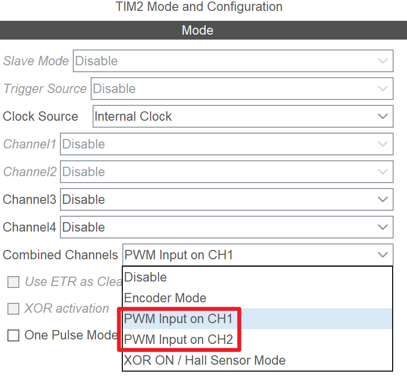

# PWM 输入模式
## 简介
CubeMX 提供了专门的 PWM 输入配置模式，用以在典型场景（测量 PWM 波参数）下快速配置输入捕获通道。

PWM 输入模式等价于进行了以下输入捕获配置：

- 将一个通道配置为输入捕获（直接）通道，另一个配置为输入捕获（间接）通道
- 将一个通道配置为上升沿捕获，另一个配置为下降沿捕获
- 配置从模式为 `Reset Mode`，触发源为其中一个通道的输入捕获 IC 信号

???+ "提示"
    有关输入捕获的详细介绍请参见 [输入捕获](../input_capture/index.md) 一节。

## 在 CubeMX 中配置 PWM 输入模式
在 CubeMX 中配置 PWM 输入模式的步骤如下：

- 配置时钟源（参见 [定时器基本用法](../basic/index.md)），通常选择内部时钟源（`Internal Clock`）
- 设置 `Combined Channels` 为 `PWM Input on CHx`，其中 `x` 决定了信号输入通道以及引脚
  

## 在 HAL 库中使用 PWM 输入模式
与输入捕获完全相同，参见 [输入捕获](../input_capture/index.md) 一节：

> 首先，开启定时器的输入捕获功能：
> 
> ```c
> // 开启 TIM2 的 Channel 1 的输入捕获功能，并使能中断
> HAL_TIM_IC_Start_IT(&htim2, TIM_CHANNEL_1);
> 
> // 开启 TIM2 的 Channel 2 的输入捕获功能，不使能中断
> // 如果需要使能 Channel 2 的中断，则应改用 HAL_TIM_IC_Start_IT
> HAL_TIM_IC_Start(&htim2, TIM_CHANNEL_2);
> ```
> 
> 然后，实现相应的中断回调函数：
> 
> ```c
> void HAL_TIM_IC_CaptureCallback(TIM_HandleTypeDef *htim)
> {
>     if (htim->Instance == TIM2) {
>         if (htim->Channel == HAL_TIM_ACTIVE_CHANNEL_1) {
>             // Channel 1 的捕获中断
> 
>             // 读取 Channel 1 的捕获值
>             uint32_t ccr1 = HAL_TIM_ReadCapturedValue(htim, TIM_CHANNEL_1);
> 
>             // 读取 Channel 2 的捕获值
>             uint32_t ccr2 = HAL_TIM_ReadCapturedValue(htim, TIM_CHANNEL_2);
>         }
>     }
> }
> ```
> 
> 在中断中，我们可以使用 `HAL_TIM_ReadCapturedValue` 函数读取捕获寄存器的值。