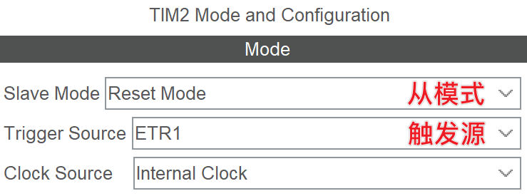

# 定时器的从模式
定时器可以被配置为自动与其它信号同步，这种工作模式称为从模式（Slave Mode）。

## 在 CubeMX 中配置从模式

如图，主要有以下几个配置项：

- **Slave Mode**：选择从模式
- **Trigger Source**：选择触发源

## 触发源（Trigger Source）
主要存在以下触发源：

- ETR1：外部信号，来自定时器的 ETR 引脚。
- ITRx：内部信号，常来自其它定时器的输出，具体定时器间连接关系需要查阅相应芯片的文档。
- TIxFPx：内部信号，来自定时器的特定引脚的输入检测 IC（输入捕获时常用）。

## 从模式：重置模式（Reset Mode）
在重置模式下，⌈触发源⌋被触发时，定时器将被重置为初始值（对于向上计数，为0；对于向下计数，为ARR）。

???+ "示例：使用输入捕获时，自动重置定时器"
    使用输入捕获时，常设置此模式，并配置 ⌈Trigger Source⌋ 为 ⌈TIxFPx⌋，以实现在捕获到特定边沿时，自动重置定时器的计数值。

    如：测量正脉冲宽度时，设置在上升沿时自动重置定时器，捕获下降沿时的计数值，再根据时钟源频率换算，即可得到正脉冲的宽度。

## 从模式：门控模式（Gated Mode）
在门控模式下，⌈触发源⌋信号有效时，定时器开始计数，直到⌈触发源⌋信号消失，定时器停止计数。

## 从模式：触发模式（Trigger Mode）
在触发模式下，⌈触发源⌋信号出现一次后，定时器被启用，开始计数。而后无论⌈触发源⌋信号是否持续存在，定时器都会一直计数。

## 从模式：外部时钟模式 1（External Clock Mode 1）
在外部时钟模式 1 下，定时器的时钟来自⌈触发源⌋信号。每当检测到⌈触发源⌋信号的上升沿时，定时器进行一次计数。

使用外部时钟模式 1 时，无法再同时使用其它从模式。

## 从模式：外部时钟模式 2 + 其它
通过配置 ⌈Clock Source⌋ 为 ⌈ETR2⌋，我们可以将定时器的时钟设置为外部时钟模式 2。在外部时钟模式 2 下，我们还可以联合使用其它从模式。但外部时钟模式 2 的时钟信号必然来源于 ETR 引脚，而不能是其它定时器的输出等“内部”信号，故不适用于定时器级联等用途。
